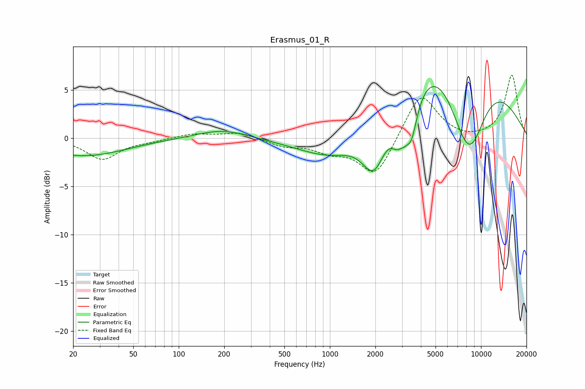

# Erasmus_01_R
See [usage instructions](https://github.com/jaakkopasanen/AutoEq#usage) for more options and info.

### Parametric EQs
Apply preamp of -5.4 dB when using parametric equalizer.

|   # | Type    |   Fc (Hz) |    Q |   Gain (dB) |
|-----|---------|-----------|------|-------------|
|   1 | Peaking |        24 | 0.51 |        -1.8 |
|   2 | Peaking |       194 | 0.84 |         1   |
|   3 | Peaking |      1134 | 0.6  |        -4.4 |
|   4 | Peaking |      1970 | 1.61 |        -6.4 |
|   5 | Peaking |      2778 | 3.19 |        -2.4 |
|   6 | Peaking |      3295 | 6    |         1.4 |
|   7 | Peaking |      3355 | 2.96 |        -6.9 |
|   8 | Peaking |      5251 | 0.27 |        11   |
|   9 | Peaking |      7728 | 1.08 |        -4.9 |
|  10 | Peaking |      8564 | 1.26 |        -5.4 |

### Fixed Band EQs
When using fixed band (also called graphic) equalizer, apply preamp of **-6.6 dB** (if available) and set gains manually with these parameters.

|   # | Type    |   Fc (Hz) |    Q |   Gain (dB) |
|-----|---------|-----------|------|-------------|
|   1 | Peaking |        31 | 1.41 |        -2.2 |
|   2 | Peaking |        62 | 1.41 |        -0.2 |
|   3 | Peaking |       125 | 1.41 |         0.5 |
|   4 | Peaking |       250 | 1.41 |         0.6 |
|   5 | Peaking |       500 | 1.41 |        -0.8 |
|   6 | Peaking |      1000 | 1.41 |        -1.2 |
|   7 | Peaking |      2000 | 1.41 |        -4   |
|   8 | Peaking |      4000 | 1.41 |         4.8 |
|   9 | Peaking |      8000 | 1.41 |        -0.2 |
|  10 | Peaking |     16000 | 1.41 |         6.5 |

### Graphs

