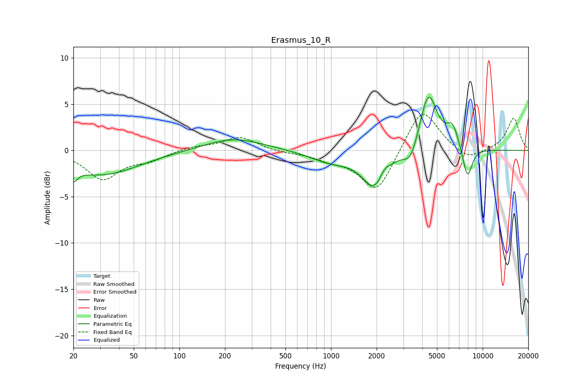

# Erasmus_10_R
See [usage instructions](https://github.com/jaakkopasanen/AutoEq#usage) for more options and info.

### Parametric EQs
Apply preamp of -5.9 dB when using parametric equalizer.

|   # | Type    |   Fc (Hz) |    Q |   Gain (dB) |
|-----|---------|-----------|------|-------------|
|   1 | Peaking |        20 | 5.22 |        -1.3 |
|   2 | Peaking |        31 | 0.57 |        -2.6 |
|   3 | Peaking |       228 | 0.74 |         1.4 |
|   4 | Peaking |       989 | 1.02 |        -1.1 |
|   5 | Peaking |      1951 | 1.75 |        -4   |
|   6 | Peaking |      2250 | 4.1  |         1   |
|   7 | Peaking |      3358 | 3.16 |        -1.9 |
|   8 | Peaking |      4389 | 2.42 |         6.4 |
|   9 | Peaking |      6341 | 3.31 |         2.3 |
|  10 | Peaking |      7927 | 4.23 |        -3.5 |

### Fixed Band EQs
When using fixed band (also called graphic) equalizer, apply preamp of **-4.0 dB** (if available) and set gains manually with these parameters.

|   # | Type    |   Fc (Hz) |    Q |   Gain (dB) |
|-----|---------|-----------|------|-------------|
|   1 | Peaking |        31 | 1.41 |        -3   |
|   2 | Peaking |        62 | 1.41 |        -0.9 |
|   3 | Peaking |       125 | 1.41 |         0.4 |
|   4 | Peaking |       250 | 1.41 |         1.5 |
|   5 | Peaking |       500 | 1.41 |        -0.2 |
|   6 | Peaking |      1000 | 1.41 |        -0.8 |
|   7 | Peaking |      2000 | 1.41 |        -4.6 |
|   8 | Peaking |      4000 | 1.41 |         4.9 |
|   9 | Peaking |      8000 | 1.41 |        -1.2 |
|  10 | Peaking |     16000 | 1.41 |         3.5 |

### Graphs

