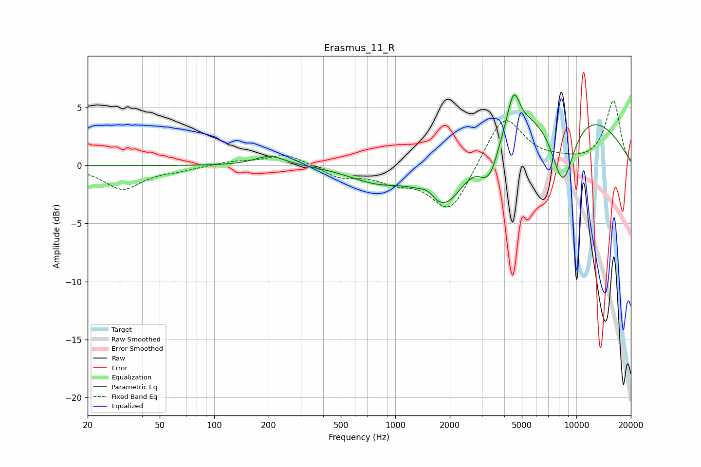

# Erasmus_11_R
See [usage instructions](https://github.com/jaakkopasanen/AutoEq#usage) for more options and info.

### Parametric EQs
Apply preamp of -6.2 dB when using parametric equalizer.

|   # | Type    |   Fc (Hz) |    Q |   Gain (dB) |
|-----|---------|-----------|------|-------------|
|   1 | Peaking |       203 | 1.72 |         0.9 |
|   2 | Peaking |       824 | 0.76 |        -2.5 |
|   3 | Peaking |      1507 | 3.45 |         0.7 |
|   4 | Peaking |      1834 | 1.54 |        -1.9 |
|   5 | Peaking |      1962 | 0.76 |        -5.9 |
|   6 | Peaking |      3289 | 5.12 |         0.7 |
|   7 | Peaking |      3299 | 3.02 |        -3.8 |
|   8 | Peaking |      4502 | 4.19 |         3.2 |
|   9 | Peaking |      4786 | 0.19 |         6.5 |
|  10 | Peaking |      8409 | 1.9  |        -6.6 |

### Fixed Band EQs
When using fixed band (also called graphic) equalizer, apply preamp of **-5.7 dB** (if available) and set gains manually with these parameters.

|   # | Type    |   Fc (Hz) |    Q |   Gain (dB) |
|-----|---------|-----------|------|-------------|
|   1 | Peaking |        31 | 1.41 |        -2   |
|   2 | Peaking |        62 | 1.41 |        -0.3 |
|   3 | Peaking |       125 | 1.41 |         0.3 |
|   4 | Peaking |       250 | 1.41 |         1   |
|   5 | Peaking |       500 | 1.41 |        -1   |
|   6 | Peaking |      1000 | 1.41 |        -1.1 |
|   7 | Peaking |      2000 | 1.41 |        -4.1 |
|   8 | Peaking |      4000 | 1.41 |         4.5 |
|   9 | Peaking |      8000 | 1.41 |         0.3 |
|  10 | Peaking |     16000 | 1.41 |         5.6 |

### Graphs

