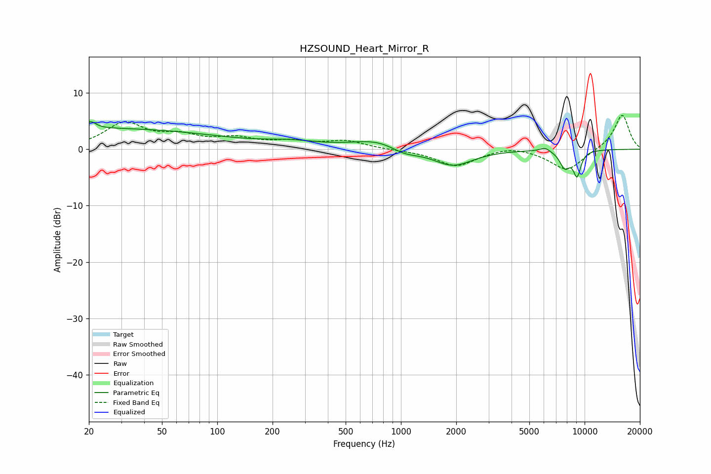

# HZSOUND_Heart_Mirror_R
See [usage instructions](https://github.com/jaakkopasanen/AutoEq#usage) for more options and info.

### Parametric EQs
Apply preamp of -5.0 dB when using parametric equalizer.

|   # | Type    |   Fc (Hz) |    Q |   Gain (dB) |
|-----|---------|-----------|------|-------------|
|   1 | Peaking |        20 | 6    |        -1.8 |
|   2 | Peaking |        20 | 5.64 |         3   |
|   3 | Peaking |        23 | 0.2  |         3.7 |
|   4 | Peaking |       253 | 0.96 |         0.9 |
|   5 | Peaking |       776 | 0.98 |         1.9 |
|   6 | Peaking |      1031 | 1.7  |        -1.5 |
|   7 | Peaking |      1917 | 1.3  |        -3   |
|   8 | Peaking |      6077 | 4.8  |         0.7 |
|   9 | Peaking |      7798 | 4.69 |        -2.9 |
|  10 | Peaking |      9098 | 6    |        -4.3 |

### Fixed Band EQs
When using fixed band (also called graphic) equalizer, apply preamp of **-6.1 dB** (if available) and set gains manually with these parameters.

|   # | Type    |   Fc (Hz) |    Q |   Gain (dB) |
|-----|---------|-----------|------|-------------|
|   1 | Peaking |        31 | 1.41 |         4.4 |
|   2 | Peaking |        62 | 1.41 |         2   |
|   3 | Peaking |       125 | 1.41 |         1.6 |
|   4 | Peaking |       250 | 1.41 |         1.1 |
|   5 | Peaking |       500 | 1.41 |         1.4 |
|   6 | Peaking |      1000 | 1.41 |        -0.1 |
|   7 | Peaking |      2000 | 1.41 |        -3   |
|   8 | Peaking |      4000 | 1.41 |         0.7 |
|   9 | Peaking |      8000 | 1.41 |        -3.8 |
|  10 | Peaking |     16000 | 1.41 |         6.2 |

### Graphs

