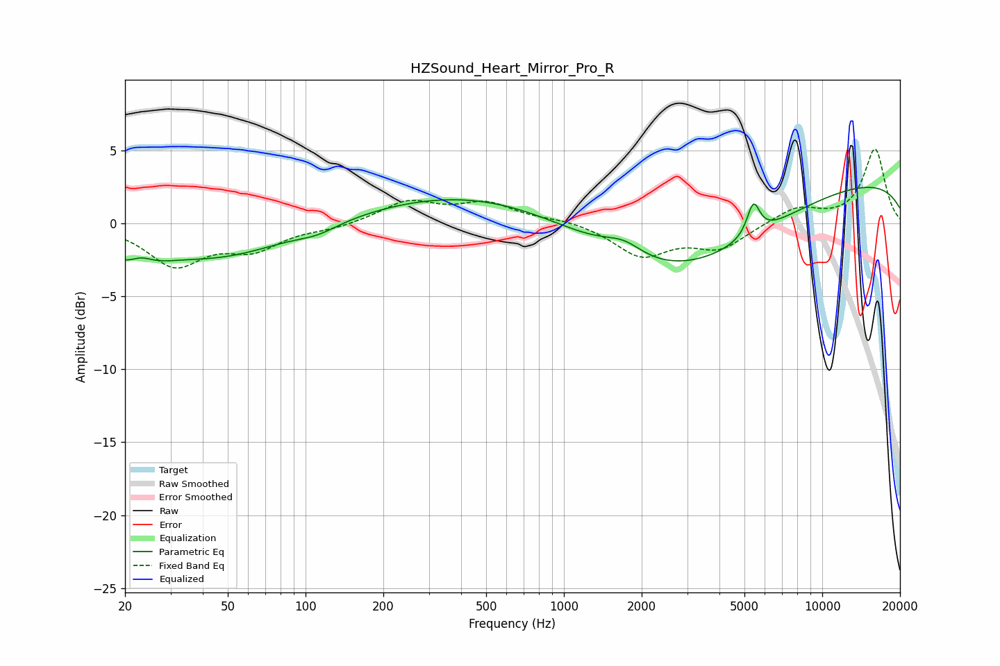

# HZSound_Heart_Mirror_Pro_R
See [usage instructions](https://github.com/jaakkopasanen/AutoEq#usage) for more options and info.

### Parametric EQs
Apply preamp of -2.6 dB when using parametric equalizer.

|   # | Type    |   Fc (Hz) |    Q |   Gain (dB) |
|-----|---------|-----------|------|-------------|
|   1 | Peaking |        22 | 1.39 |        -2.3 |
|   2 | Peaking |        23 | 2.83 |         1   |
|   3 | Peaking |        47 | 0.56 |        -2.2 |
|   4 | Peaking |       111 | 1.82 |        -0.5 |
|   5 | Peaking |       524 | 0.32 |         2.4 |
|   6 | Peaking |      1579 | 1.56 |         0.4 |
|   7 | Peaking |      1738 | 2.09 |         0.7 |
|   8 | Peaking |      2763 | 0.39 |        -5.5 |
|   9 | Peaking |      5417 | 5.58 |         2.2 |
|  10 | Peaking |      9962 | 0.18 |         3.1 |

### Fixed Band EQs
When using fixed band (also called graphic) equalizer, apply preamp of **-5.2 dB** (if available) and set gains manually with these parameters.

|   # | Type    |   Fc (Hz) |    Q |   Gain (dB) |
|-----|---------|-----------|------|-------------|
|   1 | Peaking |        31 | 1.41 |        -2.8 |
|   2 | Peaking |        62 | 1.41 |        -1.6 |
|   3 | Peaking |       125 | 1.41 |        -0.3 |
|   4 | Peaking |       250 | 1.41 |         1.5 |
|   5 | Peaking |       500 | 1.41 |         1.3 |
|   6 | Peaking |      1000 | 1.41 |         0.3 |
|   7 | Peaking |      2000 | 1.41 |        -2.2 |
|   8 | Peaking |      4000 | 1.41 |        -1.6 |
|   9 | Peaking |      8000 | 1.41 |         1.1 |
|  10 | Peaking |     16000 | 1.41 |         5.1 |

### Graphs

