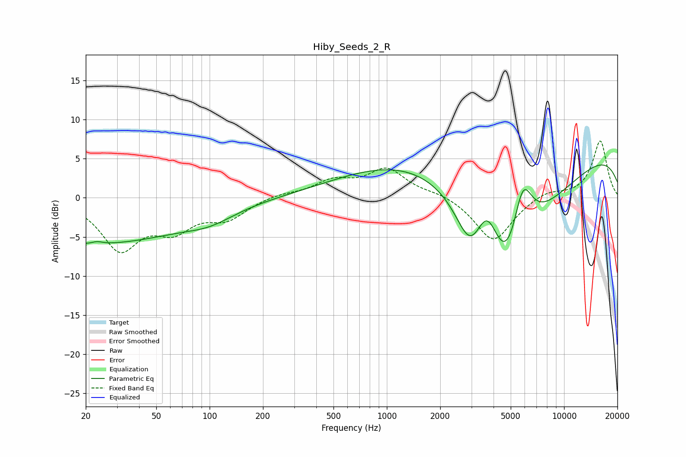

# Hiby_Seeds_2_R
See [usage instructions](https://github.com/jaakkopasanen/AutoEq#usage) for more options and info.

### Parametric EQs
Apply preamp of -4.3 dB when using parametric equalizer.

|   # | Type    |   Fc (Hz) |    Q |   Gain (dB) |
|-----|---------|-----------|------|-------------|
|   1 | Peaking |        22 | 0.26 |        -5.8 |
|   2 | Peaking |        23 | 3.97 |        -2.8 |
|   3 | Peaking |        23 | 4.09 |         3.1 |
|   4 | Peaking |       100 | 1.03 |        -1.3 |
|   5 | Peaking |      1569 | 0.34 |         5.8 |
|   6 | Peaking |      2957 | 1.8  |        -5.6 |
|   7 | Peaking |      3691 | 2.06 |         5.8 |
|   8 | Peaking |      4728 | 0.67 |       -20   |
|   9 | Peaking |      5839 | 2.34 |         8.3 |
|  10 | Peaking |      9388 | 0.18 |         7.3 |

### Fixed Band EQs
When using fixed band (also called graphic) equalizer, apply preamp of **-7.3 dB** (if available) and set gains manually with these parameters.

|   # | Type    |   Fc (Hz) |    Q |   Gain (dB) |
|-----|---------|-----------|------|-------------|
|   1 | Peaking |        31 | 1.41 |        -6.3 |
|   2 | Peaking |        62 | 1.41 |        -3.4 |
|   3 | Peaking |       125 | 1.41 |        -2.4 |
|   4 | Peaking |       250 | 1.41 |         0.5 |
|   5 | Peaking |       500 | 1.41 |         2   |
|   6 | Peaking |      1000 | 1.41 |         3.5 |
|   7 | Peaking |      2000 | 1.41 |         0.6 |
|   8 | Peaking |      4000 | 1.41 |        -5.7 |
|   9 | Peaking |      8000 | 1.41 |         0.9 |
|  10 | Peaking |     16000 | 1.41 |         7.3 |

### Graphs

