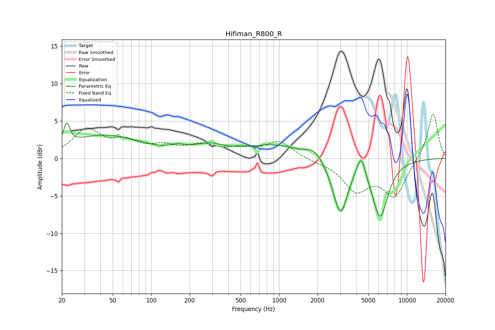

# Hifiman_R800_R
See [usage instructions](https://github.com/jaakkopasanen/AutoEq#usage) for more options and info.

### Parametric EQs
Apply preamp of -4.8 dB when using parametric equalizer.

|   # | Type    |   Fc (Hz) |    Q |   Gain (dB) |
|-----|---------|-----------|------|-------------|
|   1 | Peaking |        22 | 5.98 |         2.8 |
|   2 | Peaking |        43 | 0.49 |         3   |
|   3 | Peaking |       160 | 2.57 |         0.5 |
|   4 | Peaking |       281 | 1.12 |         1.4 |
|   5 | Peaking |       907 | 0.66 |         1.7 |
|   6 | Peaking |      1882 | 2.23 |         1.2 |
|   7 | Peaking |      2728 | 2.44 |        -1.2 |
|   8 | Peaking |      3045 | 2.69 |        -6.3 |
|   9 | Peaking |      4370 | 4.35 |         2.9 |
|  10 | Peaking |      6159 | 2.19 |        -7.7 |

### Fixed Band EQs
When using fixed band (also called graphic) equalizer, apply preamp of **-6.0 dB** (if available) and set gains manually with these parameters.

|   # | Type    |   Fc (Hz) |    Q |   Gain (dB) |
|-----|---------|-----------|------|-------------|
|   1 | Peaking |        31 | 1.41 |         3.7 |
|   2 | Peaking |        62 | 1.41 |         1.9 |
|   3 | Peaking |       125 | 1.41 |         1.3 |
|   4 | Peaking |       250 | 1.41 |         1.5 |
|   5 | Peaking |       500 | 1.41 |         1   |
|   6 | Peaking |      1000 | 1.41 |         2.2 |
|   7 | Peaking |      2000 | 1.41 |        -0.3 |
|   8 | Peaking |      4000 | 1.41 |        -4   |
|   9 | Peaking |      8000 | 1.41 |        -4.9 |
|  10 | Peaking |     16000 | 1.41 |         6.3 |

### Graphs

