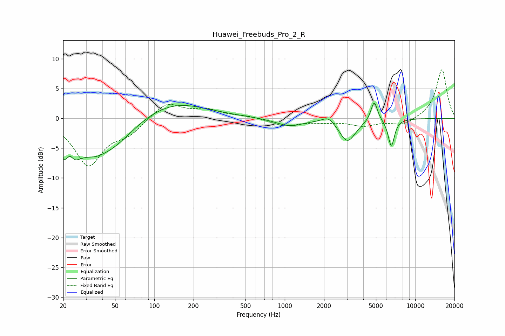

# Huawei_Freebuds_Pro_2_R
See [usage instructions](https://github.com/jaakkopasanen/AutoEq#usage) for more options and info.

### Parametric EQs
Apply preamp of -2.6 dB when using parametric equalizer.

|   # | Type    |   Fc (Hz) |    Q |   Gain (dB) |
|-----|---------|-----------|------|-------------|
|   1 | Peaking |        22 | 1.67 |        -6.7 |
|   2 | Peaking |        22 | 5.4  |         2.2 |
|   3 | Peaking |        35 | 1.67 |        -1.6 |
|   4 | Peaking |        47 | 0.82 |        -4.5 |
|   5 | Peaking |       138 | 0.56 |         2.9 |
|   6 | Peaking |      1088 | 1.34 |        -1.3 |
|   7 | Peaking |      2169 | 2.94 |         1.2 |
|   8 | Peaking |      3022 | 2.25 |        -3.9 |
|   9 | Peaking |      4848 | 5.55 |         3.5 |
|  10 | Peaking |      6557 | 5.62 |        -4.6 |

### Fixed Band EQs
When using fixed band (also called graphic) equalizer, apply preamp of **-8.3 dB** (if available) and set gains manually with these parameters.

|   # | Type    |   Fc (Hz) |    Q |   Gain (dB) |
|-----|---------|-----------|------|-------------|
|   1 | Peaking |        31 | 1.41 |        -7.7 |
|   2 | Peaking |        62 | 1.41 |        -2.2 |
|   3 | Peaking |       125 | 1.41 |         2.7 |
|   4 | Peaking |       250 | 1.41 |         1.3 |
|   5 | Peaking |       500 | 1.41 |         0.4 |
|   6 | Peaking |      1000 | 1.41 |        -1.3 |
|   7 | Peaking |      2000 | 1.41 |        -0.5 |
|   8 | Peaking |      4000 | 1.41 |        -1.2 |
|   9 | Peaking |      8000 | 1.41 |        -1.2 |
|  10 | Peaking |     16000 | 1.41 |         8.3 |

### Graphs

