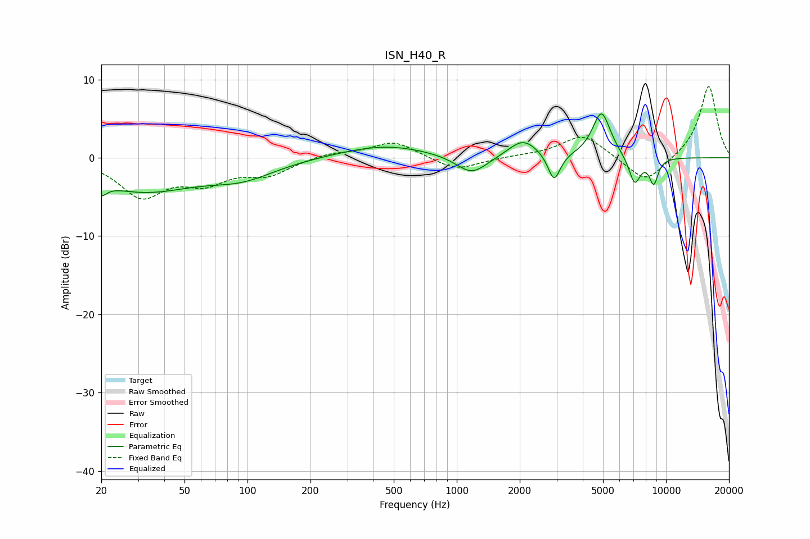

# ISN_H40_R
See [usage instructions](https://github.com/jaakkopasanen/AutoEq#usage) for more options and info.

### Parametric EQs
Apply preamp of -5.7 dB when using parametric equalizer.

|   # | Type    |   Fc (Hz) |    Q |   Gain (dB) |
|-----|---------|-----------|------|-------------|
|   1 | Peaking |        20 | 5.29 |        -1.5 |
|   2 | Peaking |        31 | 0.55 |        -4.1 |
|   3 | Peaking |        95 | 0.89 |        -2   |
|   4 | Peaking |       453 | 0.67 |         1.6 |
|   5 | Peaking |      1180 | 1.88 |        -2.5 |
|   6 | Peaking |      2075 | 2.03 |         2.3 |
|   7 | Peaking |      2920 | 4.85 |        -3.6 |
|   8 | Peaking |      4916 | 3.21 |         5.9 |
|   9 | Peaking |      7081 | 4.8  |        -3.6 |
|  10 | Peaking |      8735 | 6    |        -3.2 |

### Fixed Band EQs
When using fixed band (also called graphic) equalizer, apply preamp of **-9.2 dB** (if available) and set gains manually with these parameters.

|   # | Type    |   Fc (Hz) |    Q |   Gain (dB) |
|-----|---------|-----------|------|-------------|
|   1 | Peaking |        31 | 1.41 |        -4.7 |
|   2 | Peaking |        62 | 1.41 |        -2.7 |
|   3 | Peaking |       125 | 1.41 |        -2   |
|   4 | Peaking |       250 | 1.41 |         0.6 |
|   5 | Peaking |       500 | 1.41 |         2.1 |
|   6 | Peaking |      1000 | 1.41 |        -1.7 |
|   7 | Peaking |      2000 | 1.41 |         0.2 |
|   8 | Peaking |      4000 | 1.41 |         3   |
|   9 | Peaking |      8000 | 1.41 |        -3.4 |
|  10 | Peaking |     16000 | 1.41 |         9.3 |

### Graphs

