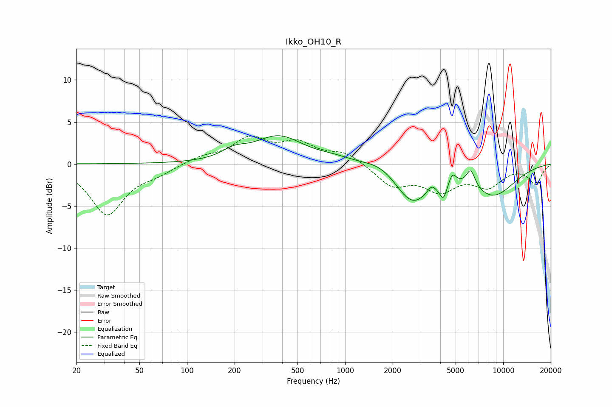

# Ikko_OH10_R
See [usage instructions](https://github.com/jaakkopasanen/AutoEq#usage) for more options and info.

### Parametric EQs
Apply preamp of -3.5 dB when using parametric equalizer.

|   # | Type    |   Fc (Hz) |    Q |   Gain (dB) |
|-----|---------|-----------|------|-------------|
|   1 | Peaking |       198 | 1.89 |         1   |
|   2 | Peaking |       381 | 0.91 |         3.2 |
|   3 | Peaking |       856 | 1.34 |         0.5 |
|   4 | Peaking |      1702 | 1.32 |         1   |
|   5 | Peaking |      2657 | 1.28 |        -4.5 |
|   6 | Peaking |      3510 | 5.99 |         0.7 |
|   7 | Peaking |      4180 | 6    |        -1.9 |
|   8 | Peaking |      4773 | 6    |         1.3 |
|   9 | Peaking |      6237 | 4.88 |         2.1 |
|  10 | Peaking |      8592 | 0.87 |        -3.6 |

### Fixed Band EQs
When using fixed band (also called graphic) equalizer, apply preamp of **-3.4 dB** (if available) and set gains manually with these parameters.

|   # | Type    |   Fc (Hz) |    Q |   Gain (dB) |
|-----|---------|-----------|------|-------------|
|   1 | Peaking |        31 | 1.41 |        -6   |
|   2 | Peaking |        62 | 1.41 |        -0.9 |
|   3 | Peaking |       125 | 1.41 |         0.8 |
|   4 | Peaking |       250 | 1.41 |         2.8 |
|   5 | Peaking |       500 | 1.41 |         2.2 |
|   6 | Peaking |      1000 | 1.41 |         1.3 |
|   7 | Peaking |      2000 | 1.41 |        -2.5 |
|   8 | Peaking |      4000 | 1.41 |        -2.8 |
|   9 | Peaking |      8000 | 1.41 |        -2.4 |
|  10 | Peaking |     16000 | 1.41 |        -2.3 |

### Graphs

