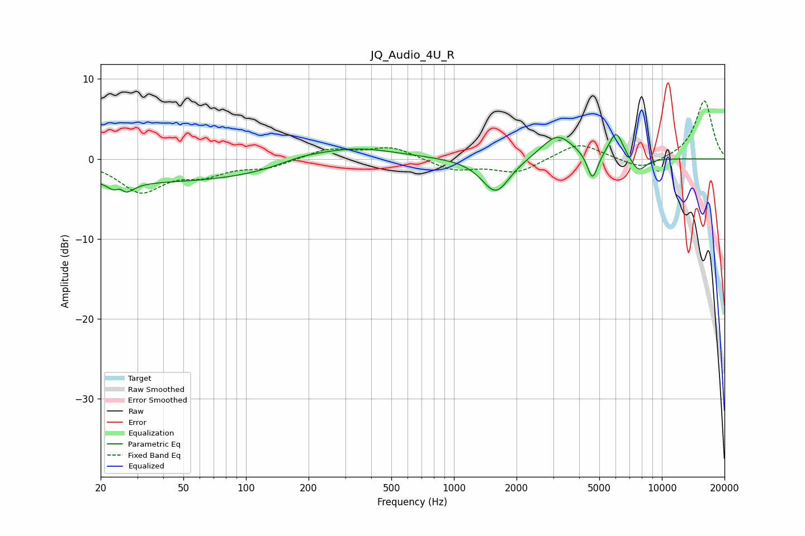

# JQ_Audio_4U_R
See [usage instructions](https://github.com/jaakkopasanen/AutoEq#usage) for more options and info.

### Parametric EQs
Apply preamp of -3.1 dB when using parametric equalizer.

|   # | Type    |   Fc (Hz) |    Q |   Gain (dB) |
|-----|---------|-----------|------|-------------|
|   1 | Peaking |        25 | 5.89 |         2.3 |
|   2 | Peaking |        25 | 3.65 |        -3.4 |
|   3 | Peaking |        41 | 0.23 |        -2.8 |
|   4 | Peaking |       183 | 1.27 |         0.7 |
|   5 | Peaking |       324 | 0.71 |         1.7 |
|   6 | Peaking |      1590 | 2.1  |        -4.4 |
|   7 | Peaking |      3144 | 1.82 |         3.1 |
|   8 | Peaking |      4636 | 5.66 |        -3.4 |
|   9 | Peaking |      6024 | 4.02 |         3.4 |
|  10 | Peaking |      7715 | 3.52 |        -1.8 |

### Fixed Band EQs
When using fixed band (also called graphic) equalizer, apply preamp of **-7.3 dB** (if available) and set gains manually with these parameters.

|   # | Type    |   Fc (Hz) |    Q |   Gain (dB) |
|-----|---------|-----------|------|-------------|
|   1 | Peaking |        31 | 1.41 |        -4   |
|   2 | Peaking |        62 | 1.41 |        -1.7 |
|   3 | Peaking |       125 | 1.41 |        -1   |
|   4 | Peaking |       250 | 1.41 |         1.2 |
|   5 | Peaking |       500 | 1.41 |         1.5 |
|   6 | Peaking |      1000 | 1.41 |        -1.4 |
|   7 | Peaking |      2000 | 1.41 |        -1.7 |
|   8 | Peaking |      4000 | 1.41 |         2.1 |
|   9 | Peaking |      8000 | 1.41 |        -1.5 |
|  10 | Peaking |     16000 | 1.41 |         7.3 |

### Graphs

