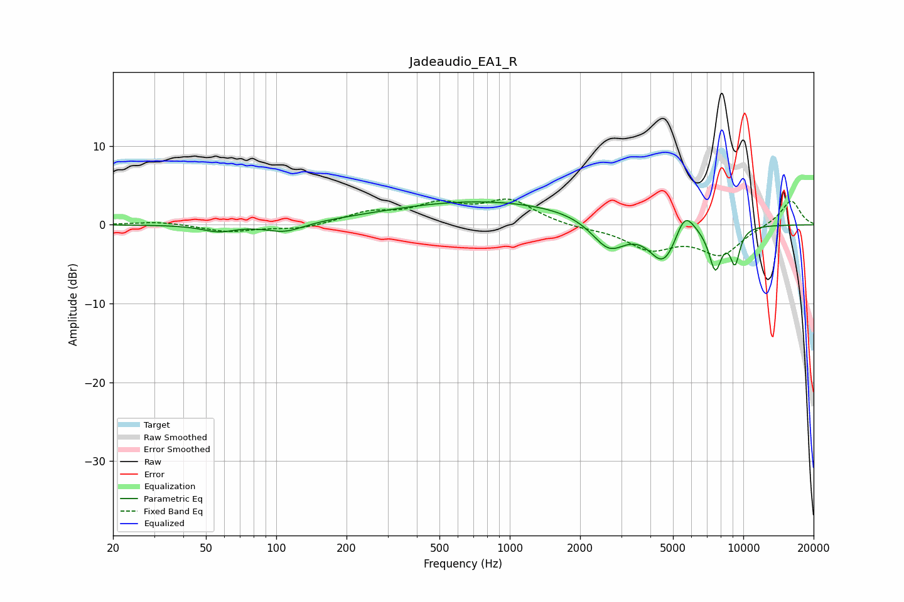

# Jadeaudio_EA1_R
See [usage instructions](https://github.com/jaakkopasanen/AutoEq#usage) for more options and info.

### Parametric EQs
Apply preamp of -3.0 dB when using parametric equalizer.

|   # | Type    |   Fc (Hz) |    Q |   Gain (dB) |
|-----|---------|-----------|------|-------------|
|   1 | Peaking |        57 | 2.01 |        -0.9 |
|   2 | Peaking |       109 | 1.75 |        -1.2 |
|   3 | Peaking |       480 | 0.39 |         0.7 |
|   4 | Peaking |       942 | 0.33 |         2.5 |
|   5 | Peaking |      2658 | 1.89 |        -3.9 |
|   6 | Peaking |      4580 | 2.32 |        -5.9 |
|   7 | Peaking |      4608 | 3.61 |         0.7 |
|   8 | Peaking |      5602 | 3.3  |         3.4 |
|   9 | Peaking |      7586 | 4.73 |        -5.3 |
|  10 | Peaking |      9216 | 5.92 |        -4.3 |

### Fixed Band EQs
When using fixed band (also called graphic) equalizer, apply preamp of **-3.4 dB** (if available) and set gains manually with these parameters.

|   # | Type    |   Fc (Hz) |    Q |   Gain (dB) |
|-----|---------|-----------|------|-------------|
|   1 | Peaking |        31 | 1.41 |         0.4 |
|   2 | Peaking |        62 | 1.41 |        -0.9 |
|   3 | Peaking |       125 | 1.41 |        -0.6 |
|   4 | Peaking |       250 | 1.41 |         1.4 |
|   5 | Peaking |       500 | 1.41 |         2.3 |
|   6 | Peaking |      1000 | 1.41 |         3   |
|   7 | Peaking |      2000 | 1.41 |        -0.4 |
|   8 | Peaking |      4000 | 1.41 |        -2.9 |
|   9 | Peaking |      8000 | 1.41 |        -3.7 |
|  10 | Peaking |     16000 | 1.41 |         3.2 |

### Graphs

