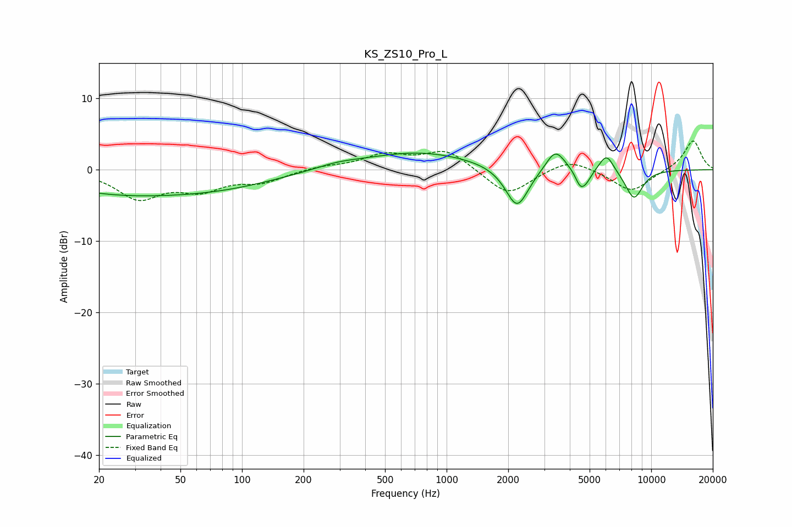

# KS_ZS10_Pro_L
See [usage instructions](https://github.com/jaakkopasanen/AutoEq#usage) for more options and info.

### Parametric EQs
Apply preamp of -2.4 dB when using parametric equalizer.

|   # | Type    |   Fc (Hz) |    Q |   Gain (dB) |
|-----|---------|-----------|------|-------------|
|   1 | Peaking |        23 | 0.44 |        -2.8 |
|   2 | Peaking |        77 | 0.47 |        -2.1 |
|   3 | Peaking |       291 | 1.25 |         0.6 |
|   4 | Peaking |       732 | 0.52 |         2.5 |
|   5 | Peaking |      2209 | 2.5  |        -5.9 |
|   6 | Peaking |      3402 | 3.05 |         3.1 |
|   7 | Peaking |      4500 | 5.56 |        -2.1 |
|   8 | Peaking |      4829 | 4.92 |        -1.3 |
|   9 | Peaking |      6053 | 3.9  |         2.5 |
|  10 | Peaking |      8235 | 3.01 |        -4.1 |

### Fixed Band EQs
When using fixed band (also called graphic) equalizer, apply preamp of **-4.1 dB** (if available) and set gains manually with these parameters.

|   # | Type    |   Fc (Hz) |    Q |   Gain (dB) |
|-----|---------|-----------|------|-------------|
|   1 | Peaking |        31 | 1.41 |        -3.8 |
|   2 | Peaking |        62 | 1.41 |        -2.5 |
|   3 | Peaking |       125 | 1.41 |        -1.5 |
|   4 | Peaking |       250 | 1.41 |         0.5 |
|   5 | Peaking |       500 | 1.41 |         2   |
|   6 | Peaking |      1000 | 1.41 |         2.8 |
|   7 | Peaking |      2000 | 1.41 |        -3.7 |
|   8 | Peaking |      4000 | 1.41 |         1.7 |
|   9 | Peaking |      8000 | 1.41 |        -3.1 |
|  10 | Peaking |     16000 | 1.41 |         4.2 |

### Graphs

