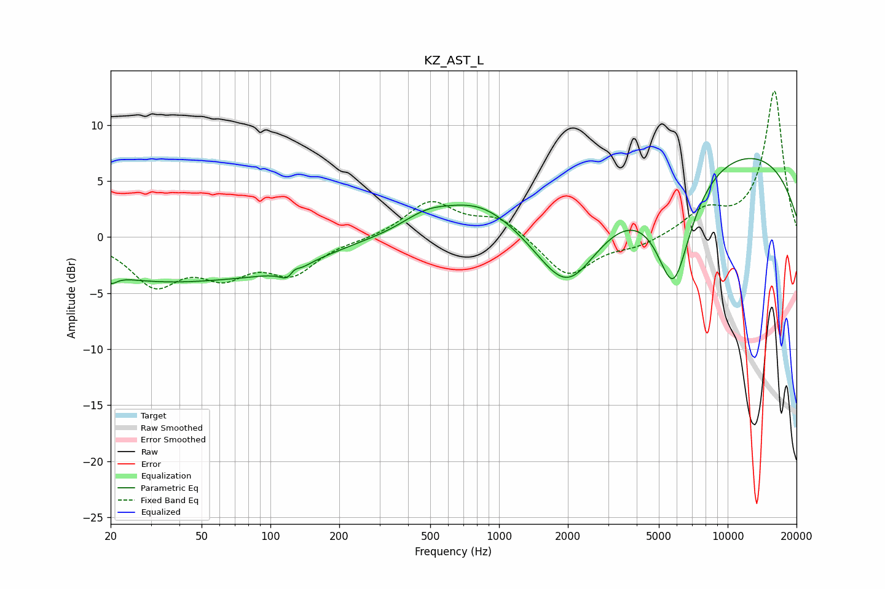

# KZ_AST_L
See [usage instructions](https://github.com/jaakkopasanen/AutoEq#usage) for more options and info.

### Parametric EQs
Apply preamp of -7.1 dB when using parametric equalizer.

|   # | Type    |   Fc (Hz) |    Q |   Gain (dB) |
|-----|---------|-----------|------|-------------|
|   1 | Peaking |        20 | 5.42 |        -0.8 |
|   2 | Peaking |        29 | 0.41 |        -3.4 |
|   3 | Peaking |       101 | 0.56 |        -1.9 |
|   4 | Peaking |       124 | 4.1  |        -3.1 |
|   5 | Peaking |       126 | 5.14 |         2.6 |
|   6 | Peaking |       478 | 1.33 |         1.3 |
|   7 | Peaking |       822 | 0.81 |         3.1 |
|   8 | Peaking |      1993 | 1.02 |        -6.8 |
|   9 | Peaking |      5794 | 1.72 |       -10.1 |
|  10 | Peaking |      9848 | 0.24 |         8   |

### Fixed Band EQs
When using fixed band (also called graphic) equalizer, apply preamp of **-13.1 dB** (if available) and set gains manually with these parameters.

|   # | Type    |   Fc (Hz) |    Q |   Gain (dB) |
|-----|---------|-----------|------|-------------|
|   1 | Peaking |        31 | 1.41 |        -4   |
|   2 | Peaking |        62 | 1.41 |        -2.8 |
|   3 | Peaking |       125 | 1.41 |        -3   |
|   4 | Peaking |       250 | 1.41 |        -0.2 |
|   5 | Peaking |       500 | 1.41 |         3.1 |
|   6 | Peaking |      1000 | 1.41 |         1.7 |
|   7 | Peaking |      2000 | 1.41 |        -3.6 |
|   8 | Peaking |      4000 | 1.41 |        -0.8 |
|   9 | Peaking |      8000 | 1.41 |         2.1 |
|  10 | Peaking |     16000 | 1.41 |        13   |

### Graphs

