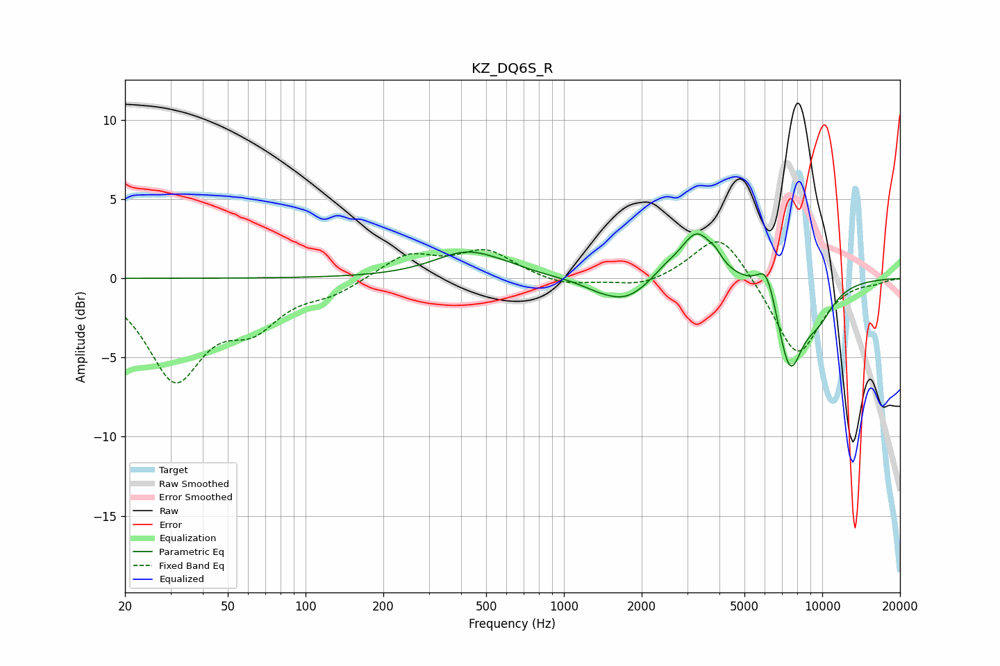

# KZ_DQ6S_R
See [usage instructions](https://github.com/jaakkopasanen/AutoEq#usage) for more options and info.

### Parametric EQs
Apply preamp of -2.9 dB when using parametric equalizer.

|   # | Type    |   Fc (Hz) |    Q |   Gain (dB) |
|-----|---------|-----------|------|-------------|
|   1 | Peaking |       424 | 1.09 |         1.7 |
|   2 | Peaking |       616 | 1.96 |         0.2 |
|   3 | Peaking |      1325 | 2.21 |        -0.2 |
|   4 | Peaking |      1723 | 1.49 |        -1.5 |
|   5 | Peaking |      2472 | 2.7  |         0.5 |
|   6 | Peaking |      3272 | 2.2  |         3   |
|   7 | Peaking |      3859 | 6    |         0.4 |
|   8 | Peaking |      6088 | 3.74 |         2.1 |
|   9 | Peaking |      7485 | 2.66 |        -5.3 |
|  10 | Peaking |      9587 | 1.85 |        -2   |

### Fixed Band EQs
When using fixed band (also called graphic) equalizer, apply preamp of **-2.4 dB** (if available) and set gains manually with these parameters.

|   # | Type    |   Fc (Hz) |    Q |   Gain (dB) |
|-----|---------|-----------|------|-------------|
|   1 | Peaking |        31 | 1.41 |        -6.1 |
|   2 | Peaking |        62 | 1.41 |        -2.5 |
|   3 | Peaking |       125 | 1.41 |        -0.8 |
|   4 | Peaking |       250 | 1.41 |         1.5 |
|   5 | Peaking |       500 | 1.41 |         1.7 |
|   6 | Peaking |      1000 | 1.41 |        -0.5 |
|   7 | Peaking |      2000 | 1.41 |        -0.6 |
|   8 | Peaking |      4000 | 1.41 |         3.1 |
|   9 | Peaking |      8000 | 1.41 |        -5   |
|  10 | Peaking |     16000 | 1.41 |        -0.2 |

### Graphs

