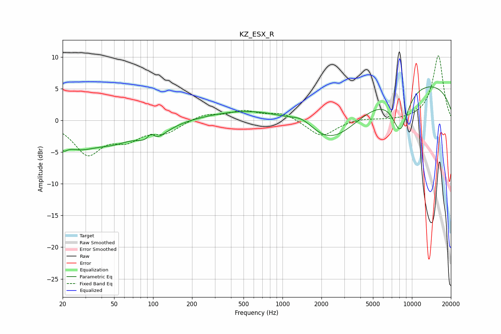

# KZ_ESX_R
See [usage instructions](https://github.com/jaakkopasanen/AutoEq#usage) for more options and info.

### Parametric EQs
Apply preamp of -5.4 dB when using parametric equalizer.

|   # | Type    |   Fc (Hz) |    Q |   Gain (dB) |
|-----|---------|-----------|------|-------------|
|   1 | Peaking |        20 | 4.71 |        -1.4 |
|   2 | Peaking |        26 | 0.89 |        -3.7 |
|   3 | Peaking |        50 | 1.07 |        -1.9 |
|   4 | Peaking |        96 | 5.68 |         1.3 |
|   5 | Peaking |        98 | 1.37 |        -2.7 |
|   6 | Peaking |       750 | 0.38 |         2.3 |
|   7 | Peaking |      1429 | 1.53 |         1.7 |
|   8 | Peaking |      2359 | 0.58 |        -6.8 |
|   9 | Peaking |      8124 | 2.12 |        -6.3 |
|  10 | Peaking |     10000 | 0.21 |         6.4 |

### Fixed Band EQs
When using fixed band (also called graphic) equalizer, apply preamp of **-10.3 dB** (if available) and set gains manually with these parameters.

|   # | Type    |   Fc (Hz) |    Q |   Gain (dB) |
|-----|---------|-----------|------|-------------|
|   1 | Peaking |        31 | 1.41 |        -5.1 |
|   2 | Peaking |        62 | 1.41 |        -2.5 |
|   3 | Peaking |       125 | 1.41 |        -1.7 |
|   4 | Peaking |       250 | 1.41 |         1   |
|   5 | Peaking |       500 | 1.41 |         1.4 |
|   6 | Peaking |      1000 | 1.41 |         1.2 |
|   7 | Peaking |      2000 | 1.41 |        -2.6 |
|   8 | Peaking |      4000 | 1.41 |         0.4 |
|   9 | Peaking |      8000 | 1.41 |        -0.1 |
|  10 | Peaking |     16000 | 1.41 |        10.3 |

### Graphs

