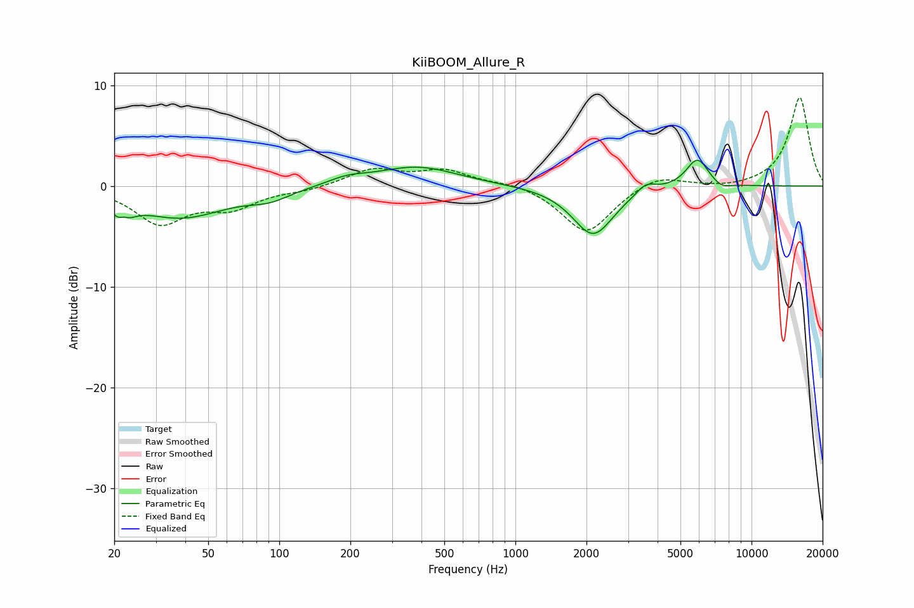

# KiiBOOM_Allure_R
See [usage instructions](https://github.com/jaakkopasanen/AutoEq#usage) for more options and info.

### Parametric EQs
Apply preamp of -2.7 dB when using parametric equalizer.

|   # | Type    |   Fc (Hz) |    Q |   Gain (dB) |
|-----|---------|-----------|------|-------------|
|   1 | Peaking |        22 | 3.98 |        -3.2 |
|   2 | Peaking |        22 | 5.78 |         1.8 |
|   3 | Peaking |        38 | 0.74 |        -3.1 |
|   4 | Peaking |        91 | 1.62 |        -0.9 |
|   5 | Peaking |       194 | 1.73 |         0.6 |
|   6 | Peaking |       382 | 0.82 |         1.9 |
|   7 | Peaking |      2133 | 1.64 |        -4.9 |
|   8 | Peaking |      3567 | 3.43 |         1   |
|   9 | Peaking |      5896 | 2.9  |         2.9 |
|  10 | Peaking |      7437 | 3.58 |        -0.5 |

### Fixed Band EQs
When using fixed band (also called graphic) equalizer, apply preamp of **-8.9 dB** (if available) and set gains manually with these parameters.

|   # | Type    |   Fc (Hz) |    Q |   Gain (dB) |
|-----|---------|-----------|------|-------------|
|   1 | Peaking |        31 | 1.41 |        -3.6 |
|   2 | Peaking |        62 | 1.41 |        -1.9 |
|   3 | Peaking |       125 | 1.41 |        -0.4 |
|   4 | Peaking |       250 | 1.41 |         1.6 |
|   5 | Peaking |       500 | 1.41 |         1.5 |
|   6 | Peaking |      1000 | 1.41 |         0.4 |
|   7 | Peaking |      2000 | 1.41 |        -4.7 |
|   8 | Peaking |      4000 | 1.41 |         1.2 |
|   9 | Peaking |      8000 | 1.41 |        -0.2 |
|  10 | Peaking |     16000 | 1.41 |         8.8 |

### Graphs

