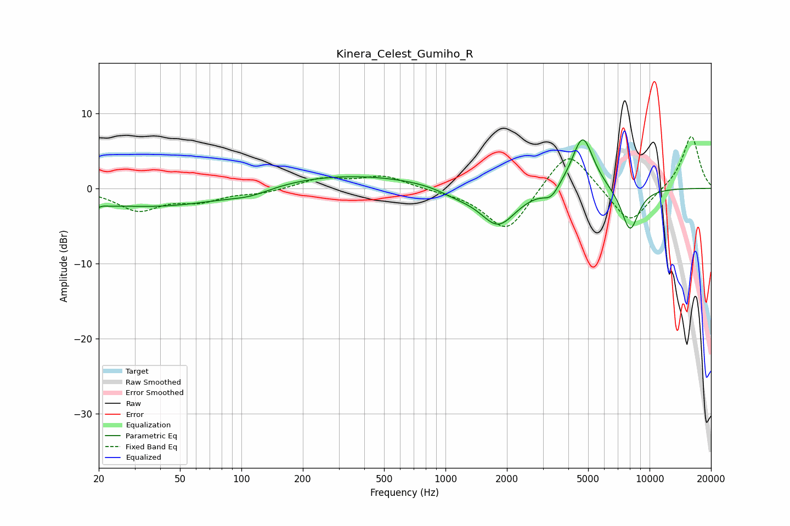

# Kinera_Celest_Gumiho_R
See [usage instructions](https://github.com/jaakkopasanen/AutoEq#usage) for more options and info.

### Parametric EQs
Apply preamp of -6.6 dB when using parametric equalizer.

|   # | Type    |   Fc (Hz) |    Q |   Gain (dB) |
|-----|---------|-----------|------|-------------|
|   1 | Peaking |        20 | 3.68 |        -2.5 |
|   2 | Peaking |        20 | 4.54 |         1.9 |
|   3 | Peaking |        40 | 0.39 |        -2.5 |
|   4 | Peaking |       111 | 1.34 |        -0.9 |
|   5 | Peaking |       303 | 0.33 |         1.9 |
|   6 | Peaking |      1125 | 1.62 |        -0.8 |
|   7 | Peaking |      1809 | 1.56 |        -5.1 |
|   8 | Peaking |      3292 | 3.67 |        -1.5 |
|   9 | Peaking |      4702 | 2.59 |         7.3 |
|  10 | Peaking |      8018 | 3.02 |        -5.9 |

### Fixed Band EQs
When using fixed band (also called graphic) equalizer, apply preamp of **-7.0 dB** (if available) and set gains manually with these parameters.

|   # | Type    |   Fc (Hz) |    Q |   Gain (dB) |
|-----|---------|-----------|------|-------------|
|   1 | Peaking |        31 | 1.41 |        -2.8 |
|   2 | Peaking |        62 | 1.41 |        -1.5 |
|   3 | Peaking |       125 | 1.41 |        -0.6 |
|   4 | Peaking |       250 | 1.41 |         1.3 |
|   5 | Peaking |       500 | 1.41 |         1.6 |
|   6 | Peaking |      1000 | 1.41 |        -0.2 |
|   7 | Peaking |      2000 | 1.41 |        -6   |
|   8 | Peaking |      4000 | 1.41 |         5.6 |
|   9 | Peaking |      8000 | 1.41 |        -5   |
|  10 | Peaking |     16000 | 1.41 |         7.1 |

### Graphs

