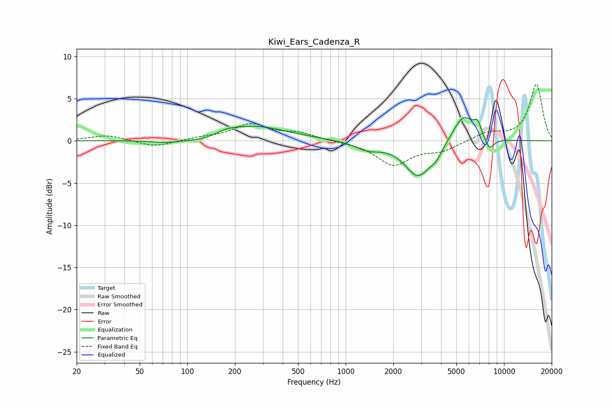

# Kiwi_Ears_Cadenza_R
See [usage instructions](https://github.com/jaakkopasanen/AutoEq#usage) for more options and info.

### Parametric EQs
Apply preamp of -2.8 dB when using parametric equalizer.

|   # | Type    |   Fc (Hz) |    Q |   Gain (dB) |
|-----|---------|-----------|------|-------------|
|   1 | Peaking |        73 | 1.6  |        -0.3 |
|   2 | Peaking |       135 | 0.99 |        -0.7 |
|   3 | Peaking |       176 | 2.04 |         0.5 |
|   4 | Peaking |       253 | 0.64 |         1.9 |
|   5 | Peaking |      1383 | 1.76 |        -0.9 |
|   6 | Peaking |      2864 | 1.68 |        -4.2 |
|   7 | Peaking |      3738 | 3.54 |        -1   |
|   8 | Peaking |      5546 | 2.01 |         3.3 |
|   9 | Peaking |      6819 | 6    |         1.4 |
|  10 | Peaking |      8084 | 4.3  |        -1.5 |

### Fixed Band EQs
When using fixed band (also called graphic) equalizer, apply preamp of **-6.8 dB** (if available) and set gains manually with these parameters.

|   # | Type    |   Fc (Hz) |    Q |   Gain (dB) |
|-----|---------|-----------|------|-------------|
|   1 | Peaking |        31 | 1.41 |         0.7 |
|   2 | Peaking |        62 | 1.41 |        -0.8 |
|   3 | Peaking |       125 | 1.41 |         0.3 |
|   4 | Peaking |       250 | 1.41 |         1.9 |
|   5 | Peaking |       500 | 1.41 |         0.8 |
|   6 | Peaking |      1000 | 1.41 |        -0.1 |
|   7 | Peaking |      2000 | 1.41 |        -2.8 |
|   8 | Peaking |      4000 | 1.41 |        -1.1 |
|   9 | Peaking |      8000 | 1.41 |         1   |
|  10 | Peaking |     16000 | 1.41 |         6.7 |

### Graphs

