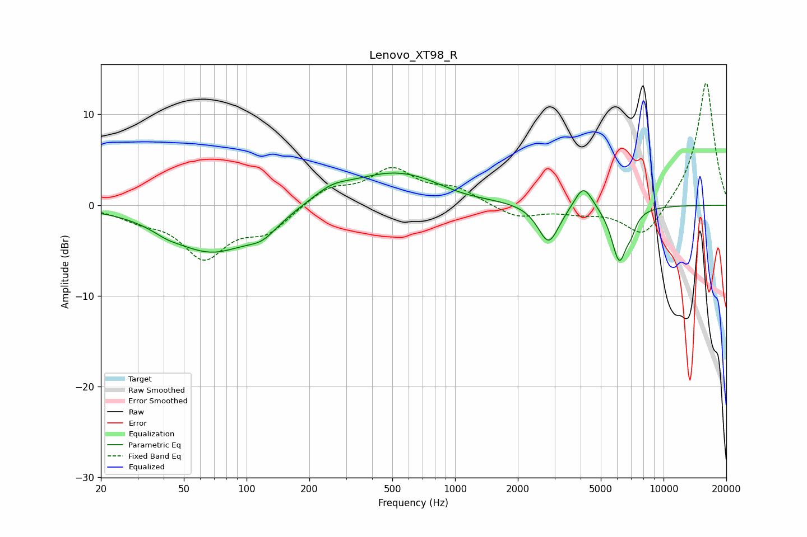

# Lenovo_XT98_R
See [usage instructions](https://github.com/jaakkopasanen/AutoEq#usage) for more options and info.

### Parametric EQs
Apply preamp of -3.6 dB when using parametric equalizer.

|   # | Type    |   Fc (Hz) |    Q |   Gain (dB) |
|-----|---------|-----------|------|-------------|
|   1 | Peaking |        41 | 2.16 |        -0.5 |
|   2 | Peaking |        68 | 0.71 |        -5   |
|   3 | Peaking |       119 | 1.9  |        -1.5 |
|   4 | Peaking |       254 | 1.63 |         1.1 |
|   5 | Peaking |       526 | 0.59 |         3.7 |
|   6 | Peaking |      1065 | 1.07 |        -0.5 |
|   7 | Peaking |      2810 | 2.78 |        -4.3 |
|   8 | Peaking |      4129 | 3.25 |         2.7 |
|   9 | Peaking |      6131 | 3.69 |        -6   |
|  10 | Peaking |      7006 | 6    |        -1.2 |

### Fixed Band EQs
When using fixed band (also called graphic) equalizer, apply preamp of **-13.6 dB** (if available) and set gains manually with these parameters.

|   # | Type    |   Fc (Hz) |    Q |   Gain (dB) |
|-----|---------|-----------|------|-------------|
|   1 | Peaking |        31 | 1.41 |        -1.2 |
|   2 | Peaking |        62 | 1.41 |        -5.4 |
|   3 | Peaking |       125 | 1.41 |        -2.7 |
|   4 | Peaking |       250 | 1.41 |         1.9 |
|   5 | Peaking |       500 | 1.41 |         3.7 |
|   6 | Peaking |      1000 | 1.41 |         1.6 |
|   7 | Peaking |      2000 | 1.41 |        -1.4 |
|   8 | Peaking |      4000 | 1.41 |        -0.7 |
|   9 | Peaking |      8000 | 1.41 |        -3.7 |
|  10 | Peaking |     16000 | 1.41 |        13.8 |

### Graphs

