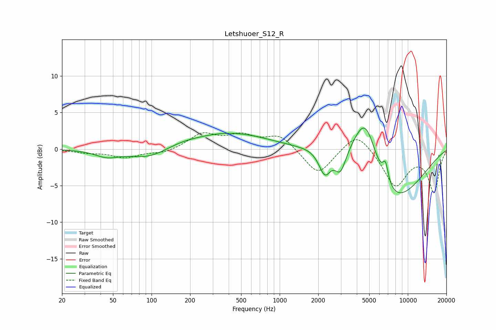

# Letshuoer_S12_R
See [usage instructions](https://github.com/jaakkopasanen/AutoEq#usage) for more options and info.

### Parametric EQs
Apply preamp of -3.0 dB when using parametric equalizer.

|   # | Type    |   Fc (Hz) |    Q |   Gain (dB) |
|-----|---------|-----------|------|-------------|
|   1 | Peaking |        45 | 1.61 |        -0.9 |
|   2 | Peaking |        95 | 0.91 |        -1.4 |
|   3 | Peaking |       168 | 1.19 |         0.3 |
|   4 | Peaking |       403 | 0.46 |         2.2 |
|   5 | Peaking |      2232 | 1.04 |         1   |
|   6 | Peaking |      2247 | 2.96 |        -3.6 |
|   7 | Peaking |      2978 | 3.3  |        -3   |
|   8 | Peaking |      4671 | 1.26 |        10   |
|   9 | Peaking |      6692 | 6    |         2.6 |
|  10 | Peaking |      6947 | 0.54 |        -9.3 |

### Fixed Band EQs
When using fixed band (also called graphic) equalizer, apply preamp of **-2.3 dB** (if available) and set gains manually with these parameters.

|   # | Type    |   Fc (Hz) |    Q |   Gain (dB) |
|-----|---------|-----------|------|-------------|
|   1 | Peaking |        31 | 1.41 |        -0.4 |
|   2 | Peaking |        62 | 1.41 |        -1.1 |
|   3 | Peaking |       125 | 1.41 |        -0.6 |
|   4 | Peaking |       250 | 1.41 |         2   |
|   5 | Peaking |       500 | 1.41 |         1.6 |
|   6 | Peaking |      1000 | 1.41 |         1.9 |
|   7 | Peaking |      2000 | 1.41 |        -3.6 |
|   8 | Peaking |      4000 | 1.41 |         2.6 |
|   9 | Peaking |      8000 | 1.41 |        -5   |
|  10 | Peaking |     16000 | 1.41 |        -5.8 |

### Graphs

