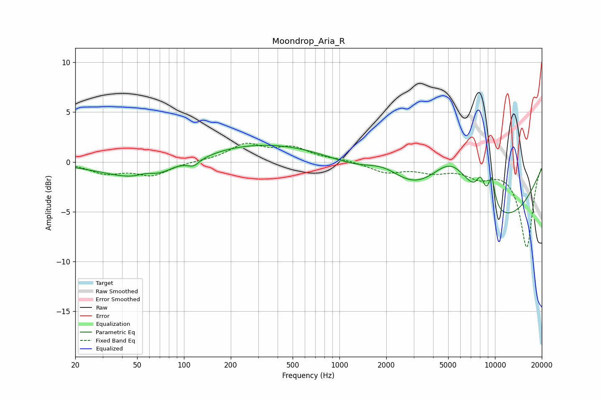

# Moondrop_Aria_R
See [usage instructions](https://github.com/jaakkopasanen/AutoEq#usage) for more options and info.

### Parametric EQs
Apply preamp of -1.8 dB when using parametric equalizer.

|   # | Type    |   Fc (Hz) |    Q |   Gain (dB) |
|-----|---------|-----------|------|-------------|
|   1 | Peaking |        57 | 2.48 |         0.4 |
|   2 | Peaking |        62 | 0.56 |        -2.6 |
|   3 | Peaking |        90 | 2.2  |         0.3 |
|   4 | Peaking |       116 | 4.09 |        -0.6 |
|   5 | Peaking |       338 | 0.21 |         2.2 |
|   6 | Peaking |      1945 | 1    |         2.4 |
|   7 | Peaking |      5265 | 0.8  |         7.6 |
|   8 | Peaking |      6159 | 0.24 |        -8.8 |
|   9 | Peaking |      8074 | 4.84 |         1.9 |
|  10 | Peaking |      9532 | 5.75 |         3   |

### Fixed Band EQs
When using fixed band (also called graphic) equalizer, apply preamp of **-2.0 dB** (if available) and set gains manually with these parameters.

|   # | Type    |   Fc (Hz) |    Q |   Gain (dB) |
|-----|---------|-----------|------|-------------|
|   1 | Peaking |        31 | 1.41 |        -1.1 |
|   2 | Peaking |        62 | 1.41 |        -1.3 |
|   3 | Peaking |       125 | 1.41 |         0   |
|   4 | Peaking |       250 | 1.41 |         1.7 |
|   5 | Peaking |       500 | 1.41 |         1.3 |
|   6 | Peaking |      1000 | 1.41 |         0.2 |
|   7 | Peaking |      2000 | 1.41 |        -1   |
|   8 | Peaking |      4000 | 1.41 |        -0.8 |
|   9 | Peaking |      8000 | 1.41 |        -1.3 |
|  10 | Peaking |     16000 | 1.41 |        -8.5 |

### Graphs

