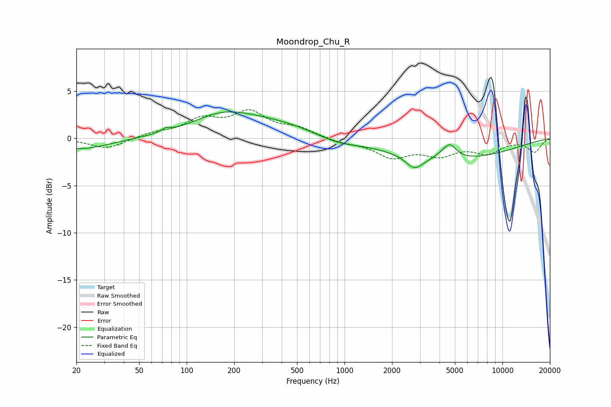

# Moondrop_Chu_R
See [usage instructions](https://github.com/jaakkopasanen/AutoEq#usage) for more options and info.

### Parametric EQs
Apply preamp of -2.9 dB when using parametric equalizer.

|   # | Type    |   Fc (Hz) |    Q |   Gain (dB) |
|-----|---------|-----------|------|-------------|
|   1 | Peaking |        21 | 0.77 |        -1.2 |
|   2 | Peaking |        74 | 5.18 |         0.4 |
|   3 | Peaking |       166 | 0.8  |         1.5 |
|   4 | Peaking |       316 | 0.41 |         1.8 |
|   5 | Peaking |       822 | 3.38 |         0   |
|   6 | Peaking |       877 | 1.02 |        -0.8 |
|   7 | Peaking |      2772 | 2.61 |        -1.4 |
|   8 | Peaking |      4022 | 3.76 |         0.2 |
|   9 | Peaking |      4641 | 3.27 |         1.6 |
|  10 | Peaking |      4723 | 0.36 |        -2.2 |

### Fixed Band EQs
When using fixed band (also called graphic) equalizer, apply preamp of **-3.1 dB** (if available) and set gains manually with these parameters.

|   # | Type    |   Fc (Hz) |    Q |   Gain (dB) |
|-----|---------|-----------|------|-------------|
|   1 | Peaking |        31 | 1.41 |        -1.1 |
|   2 | Peaking |        62 | 1.41 |         0.5 |
|   3 | Peaking |       125 | 1.41 |         1.8 |
|   4 | Peaking |       250 | 1.41 |         2.6 |
|   5 | Peaking |       500 | 1.41 |         0.9 |
|   6 | Peaking |      1000 | 1.41 |        -0.4 |
|   7 | Peaking |      2000 | 1.41 |        -1.8 |
|   8 | Peaking |      4000 | 1.41 |        -1.5 |
|   9 | Peaking |      8000 | 1.41 |        -1.4 |
|  10 | Peaking |     16000 | 1.41 |        -1.4 |

### Graphs

