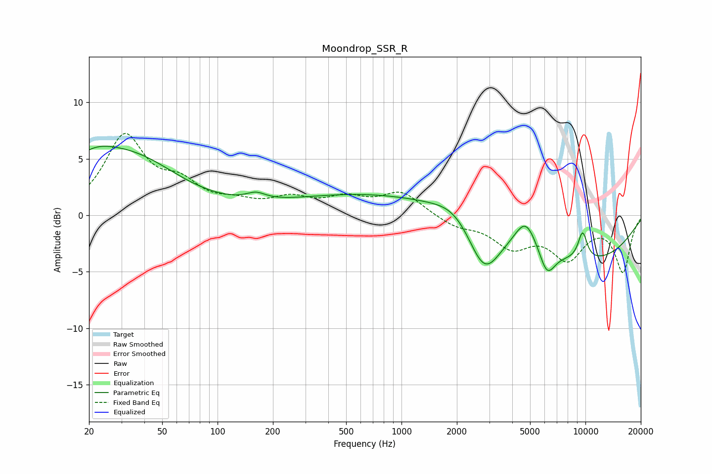

# Moondrop_SSR_R
See [usage instructions](https://github.com/jaakkopasanen/AutoEq#usage) for more options and info.

### Parametric EQs
Apply preamp of -6.2 dB when using parametric equalizer.

|   # | Type    |   Fc (Hz) |    Q |   Gain (dB) |
|-----|---------|-----------|------|-------------|
|   1 | Peaking |        20 | 0.96 |         2.9 |
|   2 | Peaking |        36 | 0.57 |         4.3 |
|   3 | Peaking |       162 | 2.69 |         0.6 |
|   4 | Peaking |       663 | 0.32 |         1.9 |
|   5 | Peaking |      1961 | 1.27 |         1.2 |
|   6 | Peaking |      2815 | 1.6  |        -4.6 |
|   7 | Peaking |      4744 | 2.3  |         2.7 |
|   8 | Peaking |      6177 | 3.13 |        -2.4 |
|   9 | Peaking |      9652 | 4.86 |         2.5 |
|  10 | Peaking |     10000 | 0.36 |        -4   |

### Fixed Band EQs
When using fixed band (also called graphic) equalizer, apply preamp of **-7.3 dB** (if available) and set gains manually with these parameters.

|   # | Type    |   Fc (Hz) |    Q |   Gain (dB) |
|-----|---------|-----------|------|-------------|
|   1 | Peaking |        31 | 1.41 |         6.8 |
|   2 | Peaking |        62 | 1.41 |         2.2 |
|   3 | Peaking |       125 | 1.41 |         0.8 |
|   4 | Peaking |       250 | 1.41 |         1.3 |
|   5 | Peaking |       500 | 1.41 |         1.3 |
|   6 | Peaking |      1000 | 1.41 |         2   |
|   7 | Peaking |      2000 | 1.41 |        -0.9 |
|   8 | Peaking |      4000 | 1.41 |        -2.5 |
|   9 | Peaking |      8000 | 1.41 |        -3.5 |
|  10 | Peaking |     16000 | 1.41 |        -4.9 |

### Graphs

