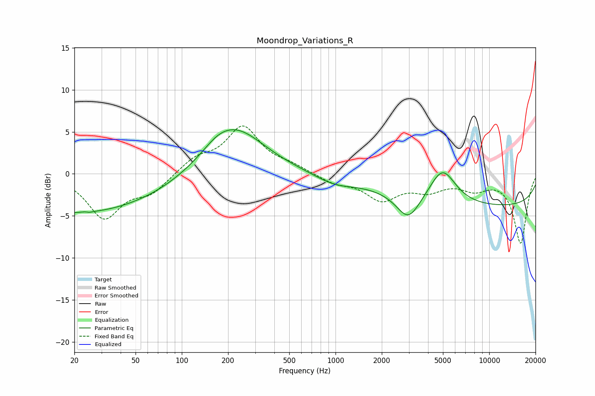

# Moondrop_Variations_R
See [usage instructions](https://github.com/jaakkopasanen/AutoEq#usage) for more options and info.

### Parametric EQs
Apply preamp of -5.3 dB when using parametric equalizer.

|   # | Type    |   Fc (Hz) |    Q |   Gain (dB) |
|-----|---------|-----------|------|-------------|
|   1 | Peaking |        21 | 0.25 |        -4.7 |
|   2 | Peaking |        25 | 5.68 |         3.4 |
|   3 | Peaking |        25 | 5.8  |        -3.4 |
|   4 | Peaking |        80 | 0.89 |        -0.1 |
|   5 | Peaking |       171 | 1.56 |         0.8 |
|   6 | Peaking |       221 | 0.72 |         5.5 |
|   7 | Peaking |       983 | 1.08 |        -1   |
|   8 | Peaking |      2973 | 1.88 |        -3.1 |
|   9 | Peaking |      4968 | 1.65 |         4.1 |
|  10 | Peaking |     10000 | 0.18 |        -3.9 |

### Fixed Band EQs
When using fixed band (also called graphic) equalizer, apply preamp of **-5.8 dB** (if available) and set gains manually with these parameters.

|   # | Type    |   Fc (Hz) |    Q |   Gain (dB) |
|-----|---------|-----------|------|-------------|
|   1 | Peaking |        31 | 1.41 |        -5.1 |
|   2 | Peaking |        62 | 1.41 |        -2   |
|   3 | Peaking |       125 | 1.41 |         1.7 |
|   4 | Peaking |       250 | 1.41 |         5.4 |
|   5 | Peaking |       500 | 1.41 |         0.8 |
|   6 | Peaking |      1000 | 1.41 |        -1   |
|   7 | Peaking |      2000 | 1.41 |        -2.9 |
|   8 | Peaking |      4000 | 1.41 |        -1.6 |
|   9 | Peaking |      8000 | 1.41 |        -1.5 |
|  10 | Peaking |     16000 | 1.41 |        -8.2 |

### Graphs

