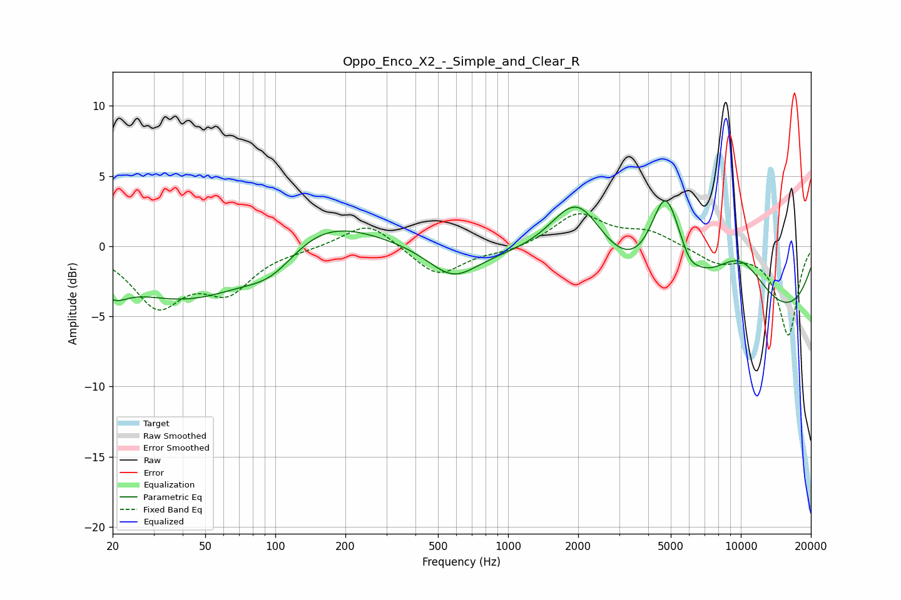

# Oppo_Enco_X2_-_Simple_and_Clear_R
See [usage instructions](https://github.com/jaakkopasanen/AutoEq#usage) for more options and info.

### Parametric EQs
Apply preamp of -3.3 dB when using parametric equalizer.

|   # | Type    |   Fc (Hz) |    Q |   Gain (dB) |
|-----|---------|-----------|------|-------------|
|   1 | Peaking |        20 | 2.28 |        -1.5 |
|   2 | Peaking |        43 | 0.47 |        -4   |
|   3 | Peaking |        98 | 1.11 |        -2.4 |
|   4 | Peaking |       137 | 0.59 |         3.2 |
|   5 | Peaking |       580 | 1.31 |        -2.2 |
|   6 | Peaking |      1989 | 1.15 |         5.7 |
|   7 | Peaking |      4757 | 2.02 |         7.1 |
|   8 | Peaking |      6033 | 4.61 |        -0.5 |
|   9 | Peaking |      8835 | 0.19 |        -6.5 |
|  10 | Peaking |      9800 | 0.89 |         4.8 |

### Fixed Band EQs
When using fixed band (also called graphic) equalizer, apply preamp of **-2.4 dB** (if available) and set gains manually with these parameters.

|   # | Type    |   Fc (Hz) |    Q |   Gain (dB) |
|-----|---------|-----------|------|-------------|
|   1 | Peaking |        31 | 1.41 |        -4   |
|   2 | Peaking |        62 | 1.41 |        -2.9 |
|   3 | Peaking |       125 | 1.41 |        -0.1 |
|   4 | Peaking |       250 | 1.41 |         1.8 |
|   5 | Peaking |       500 | 1.41 |        -2.2 |
|   6 | Peaking |      1000 | 1.41 |        -0.4 |
|   7 | Peaking |      2000 | 1.41 |         2.3 |
|   8 | Peaking |      4000 | 1.41 |         1   |
|   9 | Peaking |      8000 | 1.41 |        -1.1 |
|  10 | Peaking |     16000 | 1.41 |        -6.3 |

### Graphs

