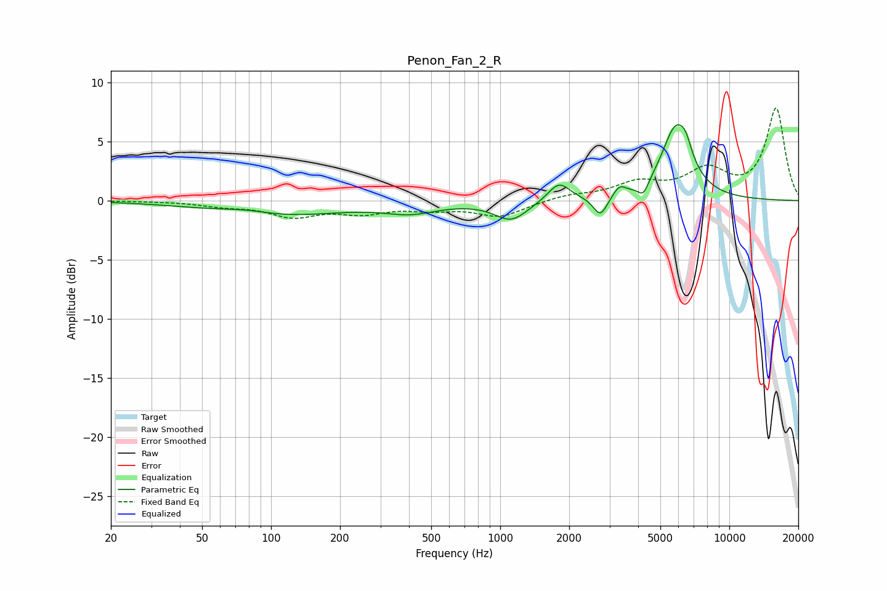

# Penon_Fan_2_R
See [usage instructions](https://github.com/jaakkopasanen/AutoEq#usage) for more options and info.

### Parametric EQs
Apply preamp of -6.5 dB when using parametric equalizer.

|   # | Type    |   Fc (Hz) |    Q |   Gain (dB) |
|-----|---------|-----------|------|-------------|
|   1 | Peaking |        77 | 1.21 |         0.5 |
|   2 | Peaking |       103 | 0.5  |        -1.3 |
|   3 | Peaking |       407 | 1.22 |        -0.8 |
|   4 | Peaking |      1118 | 1.96 |        -1.6 |
|   5 | Peaking |      1806 | 2.94 |         1.6 |
|   6 | Peaking |      2737 | 4.66 |        -1.7 |
|   7 | Peaking |      3314 | 5.28 |         0.8 |
|   8 | Peaking |      4217 | 5.99 |        -1.1 |
|   9 | Peaking |      5862 | 2.16 |         6.1 |
|  10 | Peaking |      6463 | 6    |         0.9 |

### Fixed Band EQs
When using fixed band (also called graphic) equalizer, apply preamp of **-7.9 dB** (if available) and set gains manually with these parameters.

|   # | Type    |   Fc (Hz) |    Q |   Gain (dB) |
|-----|---------|-----------|------|-------------|
|   1 | Peaking |        31 | 1.41 |        -0   |
|   2 | Peaking |        62 | 1.41 |        -0.4 |
|   3 | Peaking |       125 | 1.41 |        -1.2 |
|   4 | Peaking |       250 | 1.41 |        -0.9 |
|   5 | Peaking |       500 | 1.41 |        -0.6 |
|   6 | Peaking |      1000 | 1.41 |        -1.3 |
|   7 | Peaking |      2000 | 1.41 |         0.4 |
|   8 | Peaking |      4000 | 1.41 |         1.4 |
|   9 | Peaking |      8000 | 1.41 |         2.4 |
|  10 | Peaking |     16000 | 1.41 |         7.7 |

### Graphs

