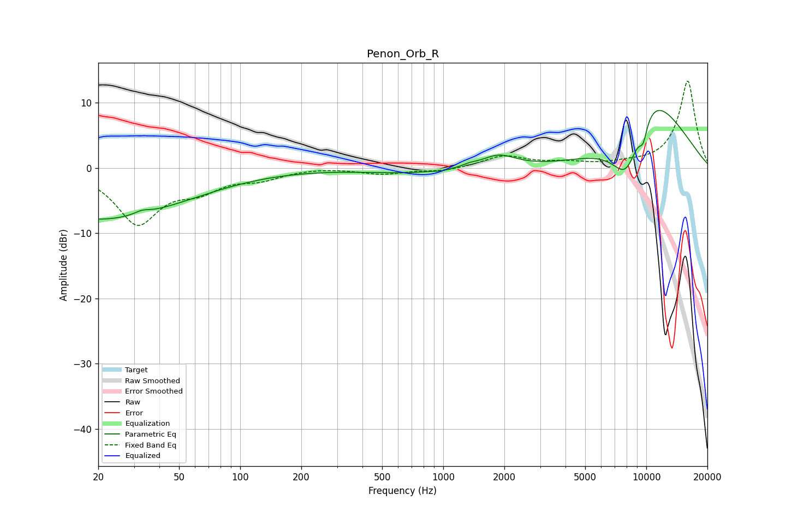

# Penon_Orb_R
See [usage instructions](https://github.com/jaakkopasanen/AutoEq#usage) for more options and info.

### Parametric EQs
Apply preamp of -8.9 dB when using parametric equalizer.

|   # | Type    |   Fc (Hz) |    Q |   Gain (dB) |
|-----|---------|-----------|------|-------------|
|   1 | Peaking |        20 | 0.32 |        -7.9 |
|   2 | Peaking |        33 | 3.88 |         0.6 |
|   3 | Peaking |       687 | 0.64 |        -0.7 |
|   4 | Peaking |       982 | 5.51 |        -0.2 |
|   5 | Peaking |      1349 | 4.42 |         0.3 |
|   6 | Peaking |      1872 | 1.63 |         2   |
|   7 | Peaking |      8007 | 0.88 |       -20   |
|   8 | Peaking |      8889 | 0.59 |         9.7 |
|   9 | Peaking |      9653 | 6    |        -2.8 |
|  10 | Peaking |     10000 | 0.57 |        12.6 |

### Fixed Band EQs
When using fixed band (also called graphic) equalizer, apply preamp of **-13.4 dB** (if available) and set gains manually with these parameters.

|   # | Type    |   Fc (Hz) |    Q |   Gain (dB) |
|-----|---------|-----------|------|-------------|
|   1 | Peaking |        31 | 1.41 |        -8.3 |
|   2 | Peaking |        62 | 1.41 |        -2.7 |
|   3 | Peaking |       125 | 1.41 |        -1.4 |
|   4 | Peaking |       250 | 1.41 |         0.2 |
|   5 | Peaking |       500 | 1.41 |        -0.9 |
|   6 | Peaking |      1000 | 1.41 |        -0.5 |
|   7 | Peaking |      2000 | 1.41 |         1.8 |
|   8 | Peaking |      4000 | 1.41 |         0.7 |
|   9 | Peaking |      8000 | 1.41 |         0.4 |
|  10 | Peaking |     16000 | 1.41 |        13.4 |

### Graphs

