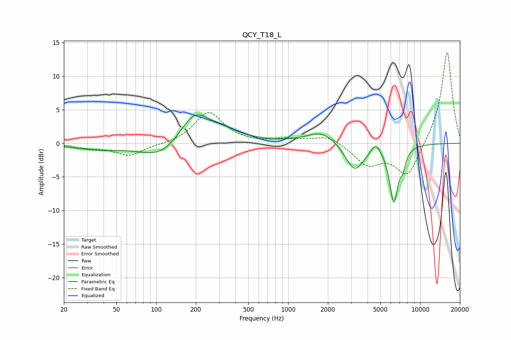

# QCY_T18_L
See [usage instructions](https://github.com/jaakkopasanen/AutoEq#usage) for more options and info.

### Parametric EQs
Apply preamp of -4.3 dB when using parametric equalizer.

|   # | Type    |   Fc (Hz) |    Q |   Gain (dB) |
|-----|---------|-----------|------|-------------|
|   1 | Peaking |        36 | 0.77 |        -0.8 |
|   2 | Peaking |       109 | 0.93 |        -2.4 |
|   3 | Peaking |       195 | 1.28 |         4.5 |
|   4 | Peaking |       314 | 2.19 |         0.5 |
|   5 | Peaking |       331 | 0.79 |         1   |
|   6 | Peaking |      1798 | 1.25 |         1.9 |
|   7 | Peaking |      3197 | 1.98 |        -4.2 |
|   8 | Peaking |      4609 | 4.04 |         1.5 |
|   9 | Peaking |      6310 | 4.16 |        -8.4 |
|  10 | Peaking |      7403 | 5.99 |        -1.9 |

### Fixed Band EQs
When using fixed band (also called graphic) equalizer, apply preamp of **-13.6 dB** (if available) and set gains manually with these parameters.

|   # | Type    |   Fc (Hz) |    Q |   Gain (dB) |
|-----|---------|-----------|------|-------------|
|   1 | Peaking |        31 | 1.41 |        -0.6 |
|   2 | Peaking |        62 | 1.41 |        -1.8 |
|   3 | Peaking |       125 | 1.41 |        -0.2 |
|   4 | Peaking |       250 | 1.41 |         4.7 |
|   5 | Peaking |       500 | 1.41 |         0   |
|   6 | Peaking |      1000 | 1.41 |         0.6 |
|   7 | Peaking |      2000 | 1.41 |         1.2 |
|   8 | Peaking |      4000 | 1.41 |        -3.1 |
|   9 | Peaking |      8000 | 1.41 |        -5   |
|  10 | Peaking |     16000 | 1.41 |        13.9 |

### Graphs

