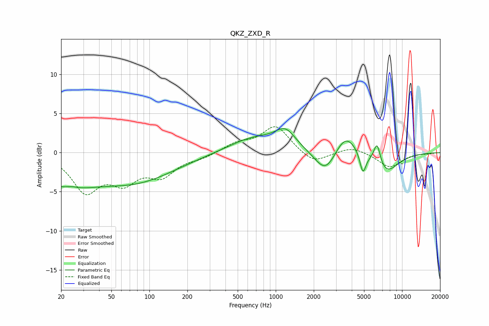

# QKZ_ZXD_R
See [usage instructions](https://github.com/jaakkopasanen/AutoEq#usage) for more options and info.

### Parametric EQs
Apply preamp of -3.2 dB when using parametric equalizer.

|   # | Type    |   Fc (Hz) |    Q |   Gain (dB) |
|-----|---------|-----------|------|-------------|
|   1 | Peaking |        21 | 0.62 |        -3.6 |
|   2 | Peaking |        24 | 2.77 |         0.4 |
|   3 | Peaking |        79 | 0.45 |        -3.4 |
|   4 | Peaking |       671 | 0.73 |         1.9 |
|   5 | Peaking |      1194 | 1.73 |         2.3 |
|   6 | Peaking |      2487 | 1.66 |        -3.1 |
|   7 | Peaking |      3565 | 1.6  |         3   |
|   8 | Peaking |      4897 | 5.85 |        -2.6 |
|   9 | Peaking |      6338 | 5.05 |         2.9 |
|  10 | Peaking |      7370 | 1.32 |        -2.7 |

### Fixed Band EQs
When using fixed band (also called graphic) equalizer, apply preamp of **-3.4 dB** (if available) and set gains manually with these parameters.

|   # | Type    |   Fc (Hz) |    Q |   Gain (dB) |
|-----|---------|-----------|------|-------------|
|   1 | Peaking |        31 | 1.41 |        -4.7 |
|   2 | Peaking |        62 | 1.41 |        -3.2 |
|   3 | Peaking |       125 | 1.41 |        -2.6 |
|   4 | Peaking |       250 | 1.41 |        -0.6 |
|   5 | Peaking |       500 | 1.41 |         1.1 |
|   6 | Peaking |      1000 | 1.41 |         3.4 |
|   7 | Peaking |      2000 | 1.41 |        -1.5 |
|   8 | Peaking |      4000 | 1.41 |         0.8 |
|   9 | Peaking |      8000 | 1.41 |        -1.9 |
|  10 | Peaking |     16000 | 1.41 |        -0.1 |

### Graphs

