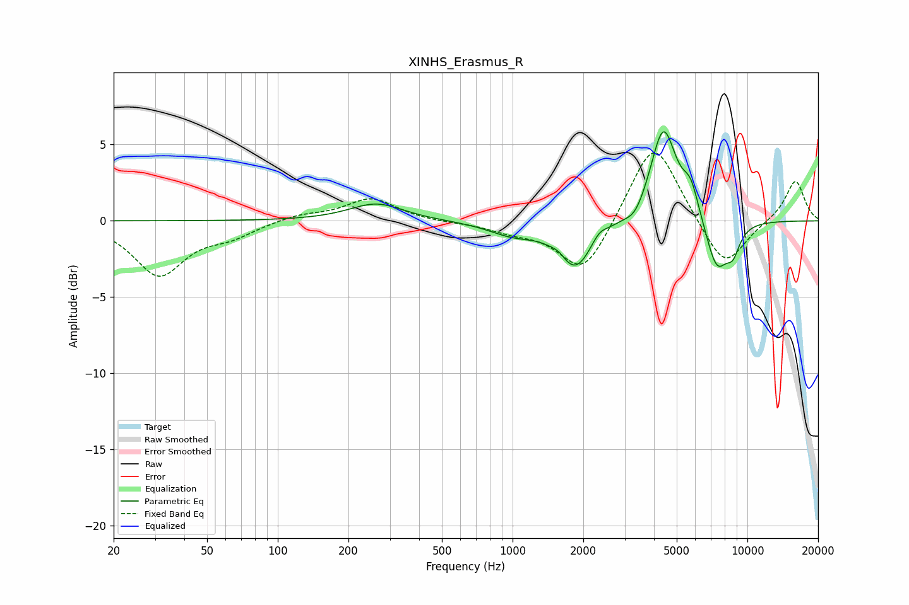

# XINHS_Erasmus_R
See [usage instructions](https://github.com/jaakkopasanen/AutoEq#usage) for more options and info.

### Parametric EQs
Apply preamp of -5.9 dB when using parametric equalizer.

|   # | Type    |   Fc (Hz) |    Q |   Gain (dB) |
|-----|---------|-----------|------|-------------|
|   1 | Peaking |       263 | 1.23 |         1.1 |
|   2 | Peaking |      1002 | 1.33 |        -0.8 |
|   3 | Peaking |      1579 | 4.8  |         0.3 |
|   4 | Peaking |      1848 | 1.91 |        -3.1 |
|   5 | Peaking |      2336 | 4.54 |         0.5 |
|   6 | Peaking |      3331 | 3.53 |        -0.8 |
|   7 | Peaking |      4386 | 2.54 |         6.2 |
|   8 | Peaking |      5739 | 3.86 |         1.9 |
|   9 | Peaking |      7409 | 2.76 |        -3.3 |
|  10 | Peaking |      8682 | 4.3  |        -1.5 |

### Fixed Band EQs
When using fixed band (also called graphic) equalizer, apply preamp of **-4.6 dB** (if available) and set gains manually with these parameters.

|   # | Type    |   Fc (Hz) |    Q |   Gain (dB) |
|-----|---------|-----------|------|-------------|
|   1 | Peaking |        31 | 1.41 |        -3.5 |
|   2 | Peaking |        62 | 1.41 |        -0.8 |
|   3 | Peaking |       125 | 1.41 |         0.4 |
|   4 | Peaking |       250 | 1.41 |         1.5 |
|   5 | Peaking |       500 | 1.41 |        -0.1 |
|   6 | Peaking |      1000 | 1.41 |        -0.6 |
|   7 | Peaking |      2000 | 1.41 |        -3.6 |
|   8 | Peaking |      4000 | 1.41 |         5.5 |
|   9 | Peaking |      8000 | 1.41 |        -3.3 |
|  10 | Peaking |     16000 | 1.41 |         2.7 |

### Graphs

