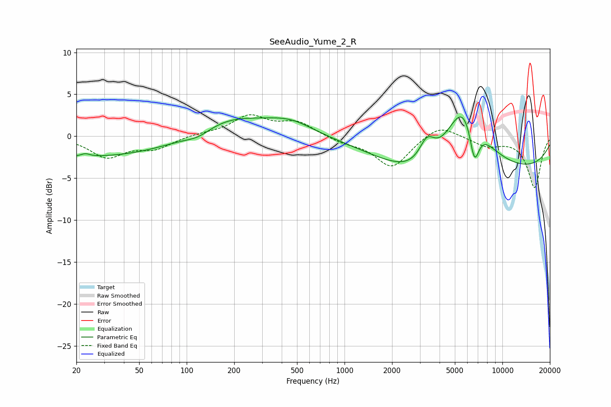

# SeeAudio_Yume_2_R
See [usage instructions](https://github.com/jaakkopasanen/AutoEq#usage) for more options and info.

### Parametric EQs
Apply preamp of -2.4 dB when using parametric equalizer.

|   # | Type    |   Fc (Hz) |    Q |   Gain (dB) |
|-----|---------|-----------|------|-------------|
|   1 | Peaking |        23 | 5.36 |         0.3 |
|   2 | Peaking |        29 | 0.18 |        -2.6 |
|   3 | Peaking |       118 | 1.65 |        -0.9 |
|   4 | Peaking |       172 | 0.56 |         3   |
|   5 | Peaking |       452 | 0.94 |         1.5 |
|   6 | Peaking |      3329 | 2.81 |         2.9 |
|   7 | Peaking |      3576 | 0.61 |        -3.1 |
|   8 | Peaking |      5716 | 1.05 |         9.9 |
|   9 | Peaking |      6644 | 4.2  |        -5   |
|  10 | Peaking |      8314 | 0.18 |        -4.4 |

### Fixed Band EQs
When using fixed band (also called graphic) equalizer, apply preamp of **-2.7 dB** (if available) and set gains manually with these parameters.

|   # | Type    |   Fc (Hz) |    Q |   Gain (dB) |
|-----|---------|-----------|------|-------------|
|   1 | Peaking |        31 | 1.41 |        -2.4 |
|   2 | Peaking |        62 | 1.41 |        -1.4 |
|   3 | Peaking |       125 | 1.41 |         0.3 |
|   4 | Peaking |       250 | 1.41 |         2.3 |
|   5 | Peaking |       500 | 1.41 |         1.6 |
|   6 | Peaking |      1000 | 1.41 |        -0.6 |
|   7 | Peaking |      2000 | 1.41 |        -3.7 |
|   8 | Peaking |      4000 | 1.41 |         1.6 |
|   9 | Peaking |      8000 | 1.41 |        -1.1 |
|  10 | Peaking |     16000 | 1.41 |        -6.1 |

### Graphs

