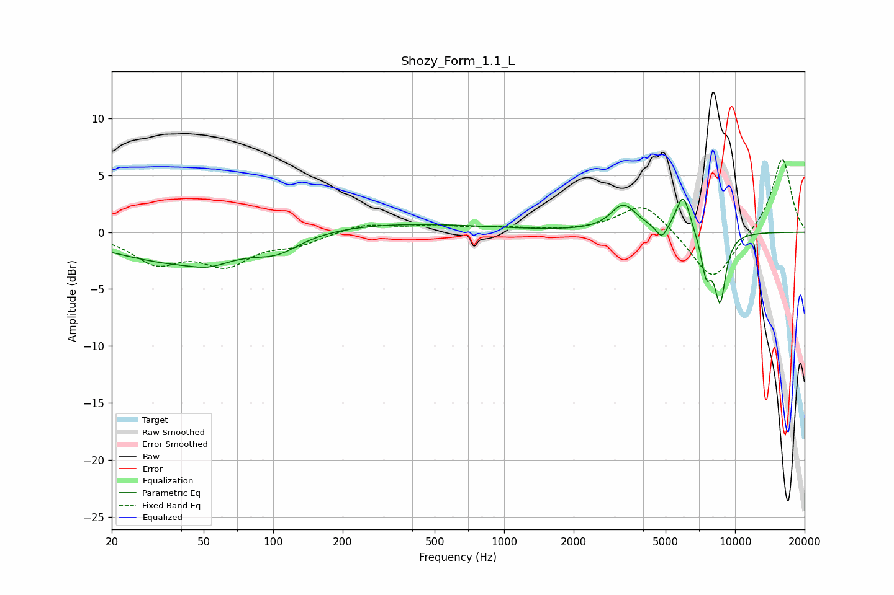

# Shozy_Form_1.1_L
See [usage instructions](https://github.com/jaakkopasanen/AutoEq#usage) for more options and info.

### Parametric EQs
Apply preamp of -3.0 dB when using parametric equalizer.

|   # | Type    |   Fc (Hz) |    Q |   Gain (dB) |
|-----|---------|-----------|------|-------------|
|   1 | Peaking |        41 | 0.47 |        -2.8 |
|   2 | Peaking |        53 | 1.97 |        -0.5 |
|   3 | Peaking |       105 | 1.49 |        -1.2 |
|   4 | Peaking |       268 | 0.3  |         0.9 |
|   5 | Peaking |      3269 | 2.69 |         2   |
|   6 | Peaking |      3534 | 1.9  |         0.4 |
|   7 | Peaking |      4816 | 5.97 |        -1.2 |
|   8 | Peaking |      5961 | 4.43 |         3.4 |
|   9 | Peaking |      7495 | 5.86 |        -3.4 |
|  10 | Peaking |      8613 | 5.19 |        -5.8 |

### Fixed Band EQs
When using fixed band (also called graphic) equalizer, apply preamp of **-6.5 dB** (if available) and set gains manually with these parameters.

|   # | Type    |   Fc (Hz) |    Q |   Gain (dB) |
|-----|---------|-----------|------|-------------|
|   1 | Peaking |        31 | 1.41 |        -2.5 |
|   2 | Peaking |        62 | 1.41 |        -2.6 |
|   3 | Peaking |       125 | 1.41 |        -0.9 |
|   4 | Peaking |       250 | 1.41 |         0.7 |
|   5 | Peaking |       500 | 1.41 |         0.5 |
|   6 | Peaking |      1000 | 1.41 |         0.3 |
|   7 | Peaking |      2000 | 1.41 |         0   |
|   8 | Peaking |      4000 | 1.41 |         2.7 |
|   9 | Peaking |      8000 | 1.41 |        -4.5 |
|  10 | Peaking |     16000 | 1.41 |         6.6 |

### Graphs

