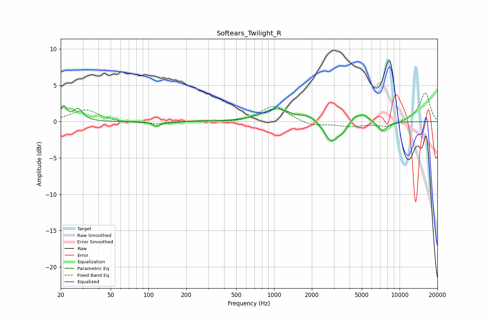

# Softears_Twilight_R
See [usage instructions](https://github.com/jaakkopasanen/AutoEq#usage) for more options and info.

### Parametric EQs
Apply preamp of -2.3 dB when using parametric equalizer.

|   # | Type    |   Fc (Hz) |    Q |   Gain (dB) |
|-----|---------|-----------|------|-------------|
|   1 | Peaking |        21 | 5.85 |         1.9 |
|   2 | Peaking |        27 | 3.96 |         1.6 |
|   3 | Peaking |       116 | 4.65 |        -0.7 |
|   4 | Peaking |      1044 | 1.32 |         1.7 |
|   5 | Peaking |      1897 | 2.27 |         0.7 |
|   6 | Peaking |      2863 | 2.55 |        -2.9 |
|   7 | Peaking |      3509 | 4.63 |        -0.7 |
|   8 | Peaking |      4361 | 5.76 |         0.5 |
|   9 | Peaking |      5090 | 3.04 |         1.2 |
|  10 | Peaking |      7295 | 3.7  |        -1.3 |

### Fixed Band EQs
When using fixed band (also called graphic) equalizer, apply preamp of **-4.0 dB** (if available) and set gains manually with these parameters.

|   # | Type    |   Fc (Hz) |    Q |   Gain (dB) |
|-----|---------|-----------|------|-------------|
|   1 | Peaking |        31 | 1.41 |         1.6 |
|   2 | Peaking |        62 | 1.41 |        -0.2 |
|   3 | Peaking |       125 | 1.41 |        -0.4 |
|   4 | Peaking |       250 | 1.41 |         0.1 |
|   5 | Peaking |       500 | 1.41 |        -0.2 |
|   6 | Peaking |      1000 | 1.41 |         2.2 |
|   7 | Peaking |      2000 | 1.41 |        -0.6 |
|   8 | Peaking |      4000 | 1.41 |        -0.6 |
|   9 | Peaking |      8000 | 1.41 |        -0.7 |
|  10 | Peaking |     16000 | 1.41 |         4   |

### Graphs

