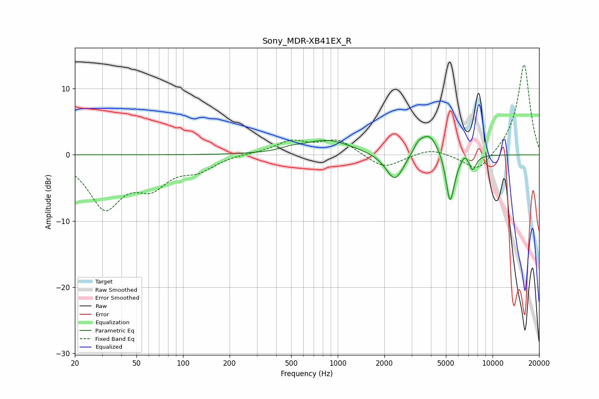

# Sony_MDR-XB41EX_R
See [usage instructions](https://github.com/jaakkopasanen/AutoEq#usage) for more options and info.

### Parametric EQs
Apply preamp of -2.9 dB when using parametric equalizer.

|   # | Type    |   Fc (Hz) |    Q |   Gain (dB) |
|-----|---------|-----------|------|-------------|
|   1 | Peaking |       498 | 2.18 |         0.4 |
|   2 | Peaking |       856 | 0.92 |         2.2 |
|   3 | Peaking |      2200 | 2.18 |        -0.6 |
|   4 | Peaking |      2357 | 2.59 |        -3.7 |
|   5 | Peaking |      3307 | 4.84 |         1   |
|   6 | Peaking |      3891 | 2.32 |         3.4 |
|   7 | Peaking |      5296 | 5.44 |        -6.5 |
|   8 | Peaking |      5575 | 4.4  |        -1.4 |
|   9 | Peaking |      6660 | 6    |         1   |
|  10 | Peaking |      7436 | 5.77 |        -2.2 |

### Fixed Band EQs
When using fixed band (also called graphic) equalizer, apply preamp of **-13.7 dB** (if available) and set gains manually with these parameters.

|   # | Type    |   Fc (Hz) |    Q |   Gain (dB) |
|-----|---------|-----------|------|-------------|
|   1 | Peaking |        31 | 1.41 |        -7.6 |
|   2 | Peaking |        62 | 1.41 |        -4   |
|   3 | Peaking |       125 | 1.41 |        -2   |
|   4 | Peaking |       250 | 1.41 |         0.2 |
|   5 | Peaking |       500 | 1.41 |         2   |
|   6 | Peaking |      1000 | 1.41 |         2.2 |
|   7 | Peaking |      2000 | 1.41 |        -2.2 |
|   8 | Peaking |      4000 | 1.41 |         1   |
|   9 | Peaking |      8000 | 1.41 |        -2.9 |
|  10 | Peaking |     16000 | 1.41 |        13.9 |

### Graphs

