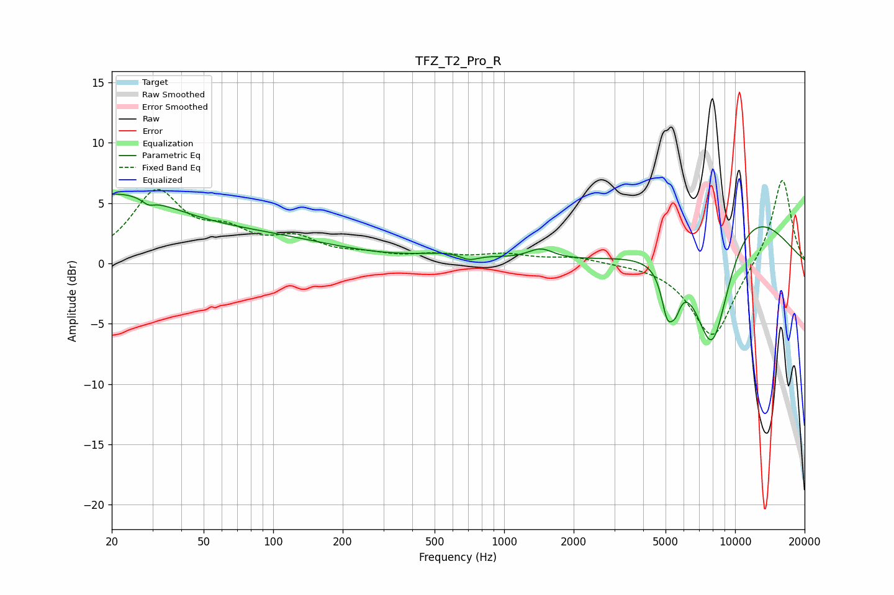

# TFZ_T2_Pro_R
See [usage instructions](https://github.com/jaakkopasanen/AutoEq#usage) for more options and info.

### Parametric EQs
Apply preamp of -5.8 dB when using parametric equalizer.

|   # | Type    |   Fc (Hz) |    Q |   Gain (dB) |
|-----|---------|-----------|------|-------------|
|   1 | Peaking |        20 | 0.52 |         5.4 |
|   2 | Peaking |        29 | 5.55 |        -0.5 |
|   3 | Peaking |        93 | 0.44 |         1.7 |
|   4 | Peaking |       622 | 1.03 |         0.7 |
|   5 | Peaking |       704 | 3.31 |        -0.6 |
|   6 | Peaking |      1441 | 2.59 |         0.9 |
|   7 | Peaking |      5088 | 5.34 |        -3.5 |
|   8 | Peaking |      5525 | 5.92 |        -1.9 |
|   9 | Peaking |      7962 | 1.49 |       -11.8 |
|  10 | Peaking |      9996 | 0.53 |         6.3 |

### Fixed Band EQs
When using fixed band (also called graphic) equalizer, apply preamp of **-7.0 dB** (if available) and set gains manually with these parameters.

|   # | Type    |   Fc (Hz) |    Q |   Gain (dB) |
|-----|---------|-----------|------|-------------|
|   1 | Peaking |        31 | 1.41 |         5.7 |
|   2 | Peaking |        62 | 1.41 |         2   |
|   3 | Peaking |       125 | 1.41 |         1.7 |
|   4 | Peaking |       250 | 1.41 |         0.5 |
|   5 | Peaking |       500 | 1.41 |         0.6 |
|   6 | Peaking |      1000 | 1.41 |         0.7 |
|   7 | Peaking |      2000 | 1.41 |         0.5 |
|   8 | Peaking |      4000 | 1.41 |         0   |
|   9 | Peaking |      8000 | 1.41 |        -6.3 |
|  10 | Peaking |     16000 | 1.41 |         7.3 |

### Graphs

