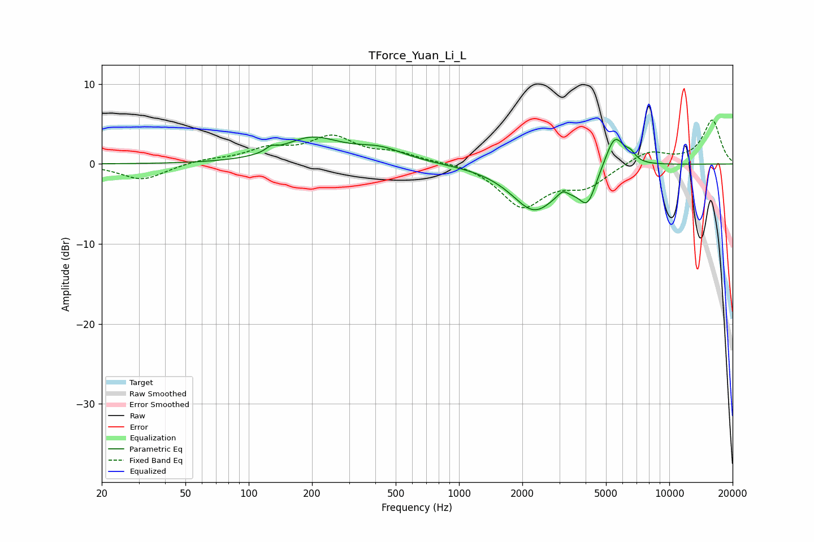

# TForce_Yuan_Li_L
See [usage instructions](https://github.com/jaakkopasanen/AutoEq#usage) for more options and info.

### Parametric EQs
Apply preamp of -3.5 dB when using parametric equalizer.

|   # | Type    |   Fc (Hz) |    Q |   Gain (dB) |
|-----|---------|-----------|------|-------------|
|   1 | Peaking |       128 | 6    |         0.6 |
|   2 | Peaking |       199 | 1.03 |         3.1 |
|   3 | Peaking |       421 | 1.19 |         1.6 |
|   4 | Peaking |      2297 | 1.28 |        -6   |
|   5 | Peaking |      2516 | 1.55 |         0.4 |
|   6 | Peaking |      3119 | 6    |         0.8 |
|   7 | Peaking |      3393 | 3.14 |        -0.6 |
|   8 | Peaking |      4087 | 3.43 |        -3.9 |
|   9 | Peaking |      5502 | 3.02 |         4.3 |
|  10 | Peaking |      6545 | 5.97 |         0.8 |

### Fixed Band EQs
When using fixed band (also called graphic) equalizer, apply preamp of **-5.6 dB** (if available) and set gains manually with these parameters.

|   # | Type    |   Fc (Hz) |    Q |   Gain (dB) |
|-----|---------|-----------|------|-------------|
|   1 | Peaking |        31 | 1.41 |        -2   |
|   2 | Peaking |        62 | 1.41 |         0.5 |
|   3 | Peaking |       125 | 1.41 |         1.7 |
|   4 | Peaking |       250 | 1.41 |         3.1 |
|   5 | Peaking |       500 | 1.41 |         1.2 |
|   6 | Peaking |      1000 | 1.41 |         0.3 |
|   7 | Peaking |      2000 | 1.41 |        -5.2 |
|   8 | Peaking |      4000 | 1.41 |        -2.5 |
|   9 | Peaking |      8000 | 1.41 |         1.7 |
|  10 | Peaking |     16000 | 1.41 |         5.5 |

### Graphs

