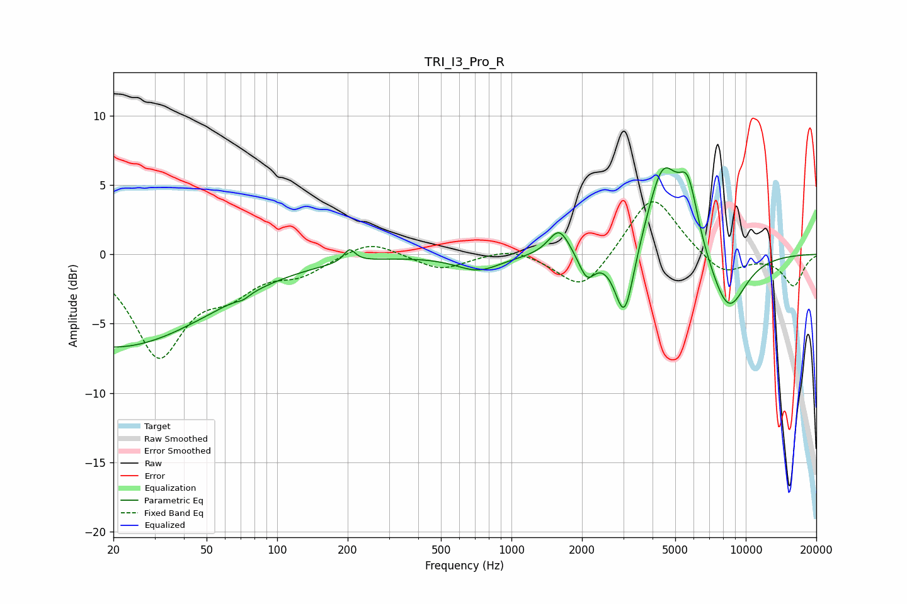

# TRI_I3_Pro_R
See [usage instructions](https://github.com/jaakkopasanen/AutoEq#usage) for more options and info.

### Parametric EQs
Apply preamp of -6.3 dB when using parametric equalizer.

|   # | Type    |   Fc (Hz) |    Q |   Gain (dB) |
|-----|---------|-----------|------|-------------|
|   1 | Peaking |        20 | 0.33 |        -6.7 |
|   2 | Peaking |        72 | 5.74 |        -0.3 |
|   3 | Peaking |       204 | 5.9  |         0.9 |
|   4 | Peaking |       722 | 1.48 |        -1.1 |
|   5 | Peaking |      1598 | 3.16 |         2   |
|   6 | Peaking |      2100 | 4.12 |        -1.8 |
|   7 | Peaking |      3039 | 3.39 |        -5.4 |
|   8 | Peaking |      4423 | 2.06 |         6.3 |
|   9 | Peaking |      5674 | 3.22 |         4.3 |
|  10 | Peaking |      8403 | 1.67 |        -4.4 |

### Fixed Band EQs
When using fixed band (also called graphic) equalizer, apply preamp of **-3.9 dB** (if available) and set gains manually with these parameters.

|   # | Type    |   Fc (Hz) |    Q |   Gain (dB) |
|-----|---------|-----------|------|-------------|
|   1 | Peaking |        31 | 1.41 |        -7.1 |
|   2 | Peaking |        62 | 1.41 |        -2.1 |
|   3 | Peaking |       125 | 1.41 |        -1.2 |
|   4 | Peaking |       250 | 1.41 |         1.1 |
|   5 | Peaking |       500 | 1.41 |        -1.1 |
|   6 | Peaking |      1000 | 1.41 |         0.6 |
|   7 | Peaking |      2000 | 1.41 |        -2.8 |
|   8 | Peaking |      4000 | 1.41 |         4.5 |
|   9 | Peaking |      8000 | 1.41 |        -1.5 |
|  10 | Peaking |     16000 | 1.41 |        -2.3 |

### Graphs

