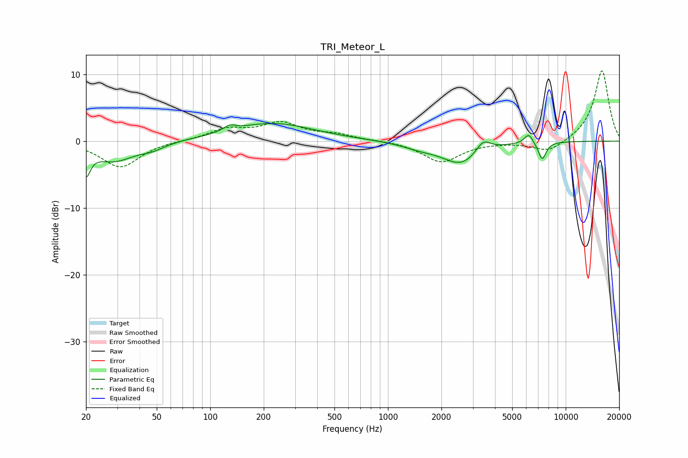

# TRI_Meteor_L
See [usage instructions](https://github.com/jaakkopasanen/AutoEq#usage) for more options and info.

### Parametric EQs
Apply preamp of -2.7 dB when using parametric equalizer.

|   # | Type    |   Fc (Hz) |    Q |   Gain (dB) |
|-----|---------|-----------|------|-------------|
|   1 | Peaking |        20 | 5.91 |        -3.7 |
|   2 | Peaking |        29 | 1.17 |        -2.9 |
|   3 | Peaking |        48 | 2.15 |        -0.7 |
|   4 | Peaking |       128 | 4.22 |         0.8 |
|   5 | Peaking |       224 | 0.61 |         2.7 |
|   6 | Peaking |      1519 | 1.36 |        -0.8 |
|   7 | Peaking |      2587 | 1.34 |        -3.3 |
|   8 | Peaking |      3434 | 3.44 |         1.9 |
|   9 | Peaking |      6192 | 5.72 |         1.5 |
|  10 | Peaking |      7380 | 6    |        -2.7 |

### Fixed Band EQs
When using fixed band (also called graphic) equalizer, apply preamp of **-10.6 dB** (if available) and set gains manually with these parameters.

|   # | Type    |   Fc (Hz) |    Q |   Gain (dB) |
|-----|---------|-----------|------|-------------|
|   1 | Peaking |        31 | 1.41 |        -3.9 |
|   2 | Peaking |        62 | 1.41 |         0.1 |
|   3 | Peaking |       125 | 1.41 |         1.7 |
|   4 | Peaking |       250 | 1.41 |         2.5 |
|   5 | Peaking |       500 | 1.41 |         0.9 |
|   6 | Peaking |      1000 | 1.41 |         0.1 |
|   7 | Peaking |      2000 | 1.41 |        -3.1 |
|   8 | Peaking |      4000 | 1.41 |        -0.1 |
|   9 | Peaking |      8000 | 1.41 |        -1.8 |
|  10 | Peaking |     16000 | 1.41 |        10.7 |

### Graphs

