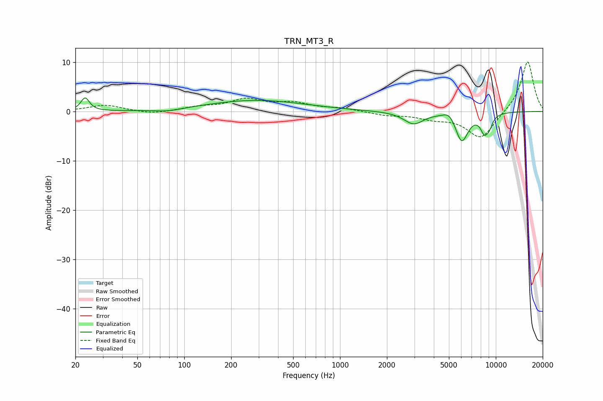

# TRN_MT3_R
See [usage instructions](https://github.com/jaakkopasanen/AutoEq#usage) for more options and info.

### Parametric EQs
Apply preamp of -2.8 dB when using parametric equalizer.

|   # | Type    |   Fc (Hz) |    Q |   Gain (dB) |
|-----|---------|-----------|------|-------------|
|   1 | Peaking |        23 | 5.3  |         2.7 |
|   2 | Peaking |        79 | 1.65 |        -0.5 |
|   3 | Peaking |       289 | 0.45 |         2.3 |
|   4 | Peaking |      2967 | 2.25 |        -2.5 |
|   5 | Peaking |      5033 | 3.66 |         1.5 |
|   6 | Peaking |      6044 | 3.37 |        -6.3 |
|   7 | Peaking |      6078 | 6    |         0.3 |
|   8 | Peaking |      8379 | 5.99 |         0.3 |
|   9 | Peaking |      8439 | 5.04 |        -3.6 |
|  10 | Peaking |      9093 | 6    |        -1.8 |

### Fixed Band EQs
When using fixed band (also called graphic) equalizer, apply preamp of **-10.1 dB** (if available) and set gains manually with these parameters.

|   # | Type    |   Fc (Hz) |    Q |   Gain (dB) |
|-----|---------|-----------|------|-------------|
|   1 | Peaking |        31 | 1.41 |         1.3 |
|   2 | Peaking |        62 | 1.41 |        -0.6 |
|   3 | Peaking |       125 | 1.41 |         0.8 |
|   4 | Peaking |       250 | 1.41 |         2.3 |
|   5 | Peaking |       500 | 1.41 |         1.5 |
|   6 | Peaking |      1000 | 1.41 |         0.6 |
|   7 | Peaking |      2000 | 1.41 |        -0.7 |
|   8 | Peaking |      4000 | 1.41 |        -1.2 |
|   9 | Peaking |      8000 | 1.41 |        -5.6 |
|  10 | Peaking |     16000 | 1.41 |        10.4 |

### Graphs

