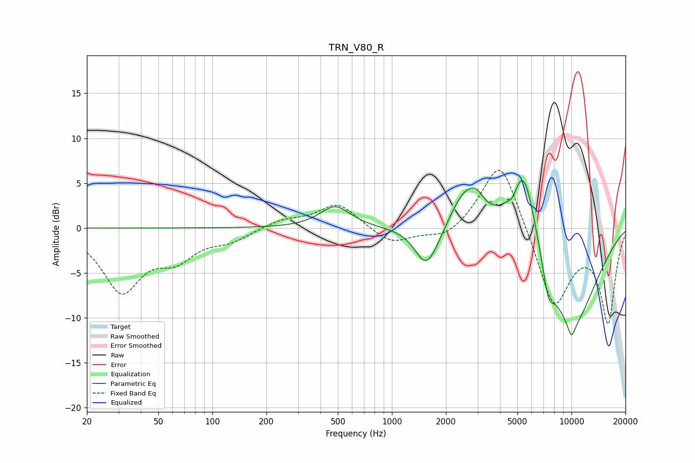

# TRN_V80_R
See [usage instructions](https://github.com/jaakkopasanen/AutoEq#usage) for more options and info.

### Parametric EQs
Apply preamp of -5.4 dB when using parametric equalizer.

|   # | Type    |   Fc (Hz) |    Q |   Gain (dB) |
|-----|---------|-----------|------|-------------|
|   1 | Peaking |       483 | 1.68 |         2.4 |
|   2 | Peaking |      1546 | 2.29 |        -3.8 |
|   3 | Peaking |      1715 | 1.82 |        -1.2 |
|   4 | Peaking |      2585 | 1.58 |         4.7 |
|   5 | Peaking |      2971 | 3.97 |         1   |
|   6 | Peaking |      4714 | 6    |        -0.9 |
|   7 | Peaking |      5419 | 1.84 |         9.6 |
|   8 | Peaking |      7426 | 4.12 |        -3.4 |
|   9 | Peaking |     10000 | 0.77 |       -11.2 |
|  10 | Peaking |     10000 | 5.93 |        -1.6 |

### Fixed Band EQs
When using fixed band (also called graphic) equalizer, apply preamp of **-6.5 dB** (if available) and set gains manually with these parameters.

|   # | Type    |   Fc (Hz) |    Q |   Gain (dB) |
|-----|---------|-----------|------|-------------|
|   1 | Peaking |        31 | 1.41 |        -6.8 |
|   2 | Peaking |        62 | 1.41 |        -2.8 |
|   3 | Peaking |       125 | 1.41 |        -1.2 |
|   4 | Peaking |       250 | 1.41 |         0.9 |
|   5 | Peaking |       500 | 1.41 |         2.8 |
|   6 | Peaking |      1000 | 1.41 |        -1.8 |
|   7 | Peaking |      2000 | 1.41 |        -1.4 |
|   8 | Peaking |      4000 | 1.41 |         8.2 |
|   9 | Peaking |      8000 | 1.41 |        -9   |
|  10 | Peaking |     16000 | 1.41 |       -10.3 |

### Graphs

