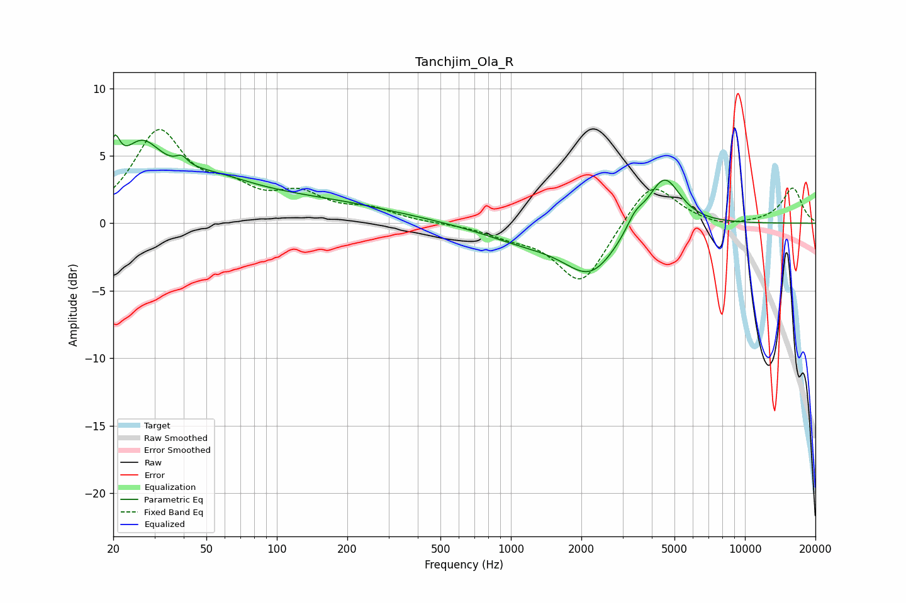

# Tanchjim_Ola_R
See [usage instructions](https://github.com/jaakkopasanen/AutoEq#usage) for more options and info.

### Parametric EQs
Apply preamp of -6.6 dB when using parametric equalizer.

|   # | Type    |   Fc (Hz) |    Q |   Gain (dB) |
|-----|---------|-----------|------|-------------|
|   1 | Peaking |        20 | 5.98 |         3   |
|   2 | Peaking |        26 | 1.62 |         4.2 |
|   3 | Peaking |        39 | 5.79 |         0.7 |
|   4 | Peaking |        47 | 0.73 |         2.1 |
|   5 | Peaking |       118 | 0.34 |         1.6 |
|   6 | Peaking |       187 | 1.36 |         0   |
|   7 | Peaking |      1154 | 0.74 |        -1.2 |
|   8 | Peaking |      2193 | 1.25 |        -3.4 |
|   9 | Peaking |      3396 | 3.67 |         1   |
|  10 | Peaking |      4519 | 2.02 |         3.8 |

### Fixed Band EQs
When using fixed band (also called graphic) equalizer, apply preamp of **-7.0 dB** (if available) and set gains manually with these parameters.

|   # | Type    |   Fc (Hz) |    Q |   Gain (dB) |
|-----|---------|-----------|------|-------------|
|   1 | Peaking |        31 | 1.41 |         6.5 |
|   2 | Peaking |        62 | 1.41 |         1.9 |
|   3 | Peaking |       125 | 1.41 |         1.8 |
|   4 | Peaking |       250 | 1.41 |         0.9 |
|   5 | Peaking |       500 | 1.41 |        -0   |
|   6 | Peaking |      1000 | 1.41 |        -0.7 |
|   7 | Peaking |      2000 | 1.41 |        -4.6 |
|   8 | Peaking |      4000 | 1.41 |         3.3 |
|   9 | Peaking |      8000 | 1.41 |        -0.4 |
|  10 | Peaking |     16000 | 1.41 |         2.6 |

### Graphs

