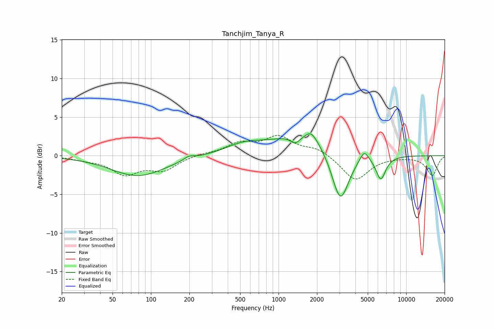

# Tanchjim_Tanya_R
See [usage instructions](https://github.com/jaakkopasanen/AutoEq#usage) for more options and info.

### Parametric EQs
Apply preamp of -2.9 dB when using parametric equalizer.

|   # | Type    |   Fc (Hz) |    Q |   Gain (dB) |
|-----|---------|-----------|------|-------------|
|   1 | Peaking |        79 | 0.67 |        -2.6 |
|   2 | Peaking |       199 | 3.58 |         0.5 |
|   3 | Peaking |       539 | 0.91 |         1.3 |
|   4 | Peaking |      1355 | 3.58 |        -1.1 |
|   5 | Peaking |      1590 | 0.65 |         2.9 |
|   6 | Peaking |      1782 | 3.6  |         0.8 |
|   7 | Peaking |      1906 | 2.91 |         0.4 |
|   8 | Peaking |      3046 | 2.08 |        -6.9 |
|   9 | Peaking |      4690 | 3.99 |         1.5 |
|  10 | Peaking |      6328 | 3.56 |        -3   |

### Fixed Band EQs
When using fixed band (also called graphic) equalizer, apply preamp of **-2.7 dB** (if available) and set gains manually with these parameters.

|   # | Type    |   Fc (Hz) |    Q |   Gain (dB) |
|-----|---------|-----------|------|-------------|
|   1 | Peaking |        31 | 1.41 |        -0.4 |
|   2 | Peaking |        62 | 1.41 |        -2.2 |
|   3 | Peaking |       125 | 1.41 |        -1.7 |
|   4 | Peaking |       250 | 1.41 |         0.2 |
|   5 | Peaking |       500 | 1.41 |         1.5 |
|   6 | Peaking |      1000 | 1.41 |         2.3 |
|   7 | Peaking |      2000 | 1.41 |         0.9 |
|   8 | Peaking |      4000 | 1.41 |        -3.2 |
|   9 | Peaking |      8000 | 1.41 |        -0.1 |
|  10 | Peaking |     16000 | 1.41 |        -2.5 |

### Graphs

