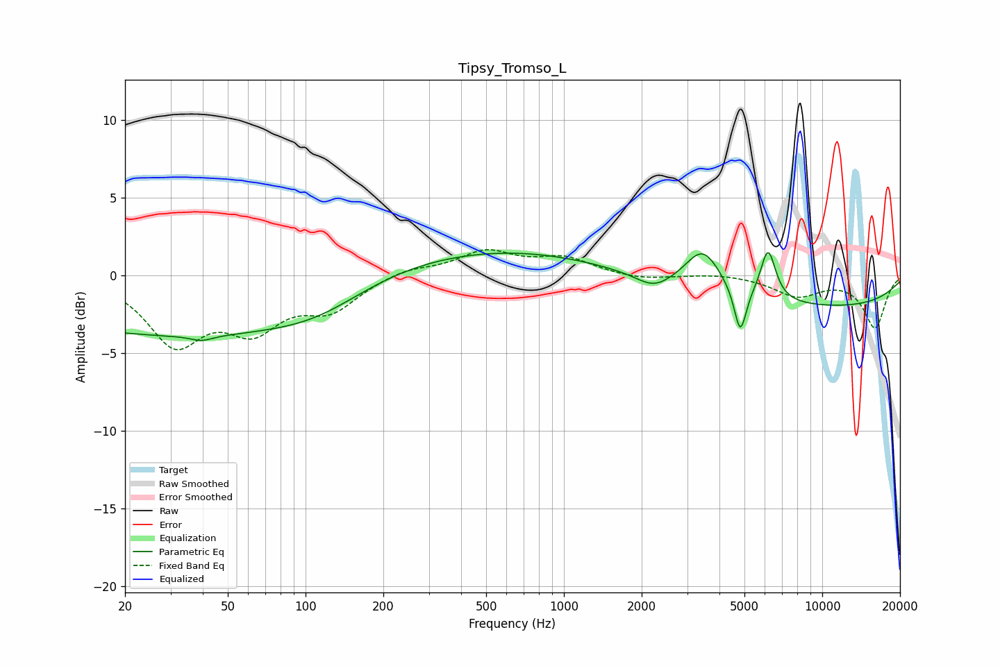

# Tipsy_Tromso_L
See [usage instructions](https://github.com/jaakkopasanen/AutoEq#usage) for more options and info.

### Parametric EQs
Apply preamp of -1.5 dB when using parametric equalizer.

|   # | Type    |   Fc (Hz) |    Q |   Gain (dB) |
|-----|---------|-----------|------|-------------|
|   1 | Peaking |        20 | 0.19 |        -3.3 |
|   2 | Peaking |        40 | 3.43 |        -0.3 |
|   3 | Peaking |       113 | 0.7  |        -1.5 |
|   4 | Peaking |       126 | 0.21 |        -1.2 |
|   5 | Peaking |       336 | 0.27 |         2.6 |
|   6 | Peaking |      2227 | 2.07 |        -0.9 |
|   7 | Peaking |      3452 | 2.07 |         2.6 |
|   8 | Peaking |      4816 | 6    |        -3   |
|   9 | Peaking |      6171 | 4.71 |         3.2 |
|  10 | Peaking |      9918 | 0.26 |        -2   |

### Fixed Band EQs
When using fixed band (also called graphic) equalizer, apply preamp of **-1.7 dB** (if available) and set gains manually with these parameters.

|   # | Type    |   Fc (Hz) |    Q |   Gain (dB) |
|-----|---------|-----------|------|-------------|
|   1 | Peaking |        31 | 1.41 |        -4.2 |
|   2 | Peaking |        62 | 1.41 |        -3   |
|   3 | Peaking |       125 | 1.41 |        -2   |
|   4 | Peaking |       250 | 1.41 |         0.5 |
|   5 | Peaking |       500 | 1.41 |         1.5 |
|   6 | Peaking |      1000 | 1.41 |         1   |
|   7 | Peaking |      2000 | 1.41 |        -0.3 |
|   8 | Peaking |      4000 | 1.41 |         0.2 |
|   9 | Peaking |      8000 | 1.41 |        -1.3 |
|  10 | Peaking |     16000 | 1.41 |        -3.3 |

### Graphs

