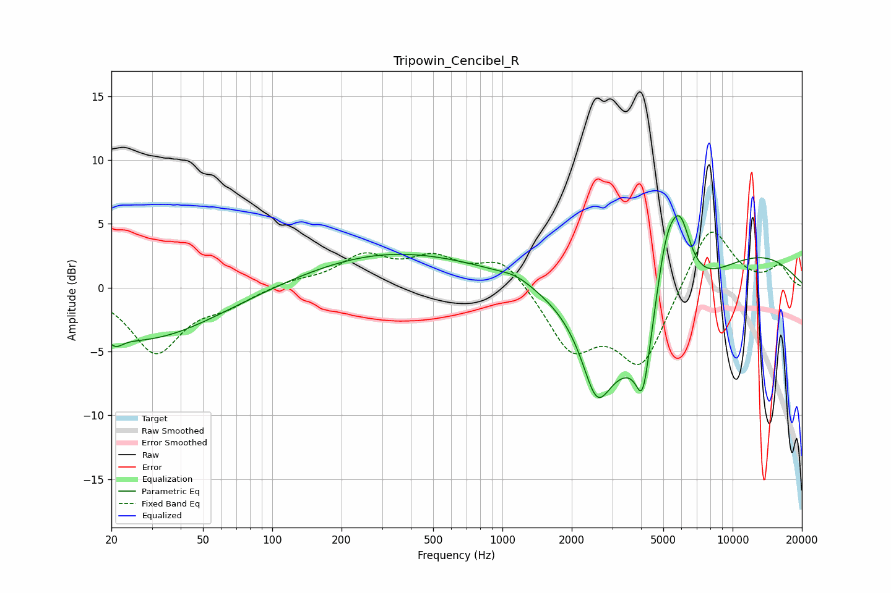

# Tripowin_Cencibel_R
See [usage instructions](https://github.com/jaakkopasanen/AutoEq#usage) for more options and info.

### Parametric EQs
Apply preamp of -5.7 dB when using parametric equalizer.

|   # | Type    |   Fc (Hz) |    Q |   Gain (dB) |
|-----|---------|-----------|------|-------------|
|   1 | Peaking |        21 | 4.73 |        -0.7 |
|   2 | Peaking |        27 | 0.44 |        -4.1 |
|   3 | Peaking |       318 | 0.39 |         2.6 |
|   4 | Peaking |      1147 | 2.28 |         0.4 |
|   5 | Peaking |      2565 | 2.35 |        -5   |
|   6 | Peaking |      3793 | 0.56 |       -11   |
|   7 | Peaking |      4076 | 4.73 |        -4.4 |
|   8 | Peaking |      5128 | 2.77 |         5.6 |
|   9 | Peaking |      5448 | 0.2  |         5.2 |
|  10 | Peaking |      5911 | 2.73 |         5.7 |

### Fixed Band EQs
When using fixed band (also called graphic) equalizer, apply preamp of **-4.4 dB** (if available) and set gains manually with these parameters.

|   # | Type    |   Fc (Hz) |    Q |   Gain (dB) |
|-----|---------|-----------|------|-------------|
|   1 | Peaking |        31 | 1.41 |        -5   |
|   2 | Peaking |        62 | 1.41 |        -1.1 |
|   3 | Peaking |       125 | 1.41 |         0.5 |
|   4 | Peaking |       250 | 1.41 |         2.3 |
|   5 | Peaking |       500 | 1.41 |         2   |
|   6 | Peaking |      1000 | 1.41 |         2.4 |
|   7 | Peaking |      2000 | 1.41 |        -4.7 |
|   8 | Peaking |      4000 | 1.41 |        -6   |
|   9 | Peaking |      8000 | 1.41 |         5.2 |
|  10 | Peaking |     16000 | 1.41 |         1.6 |

### Graphs

