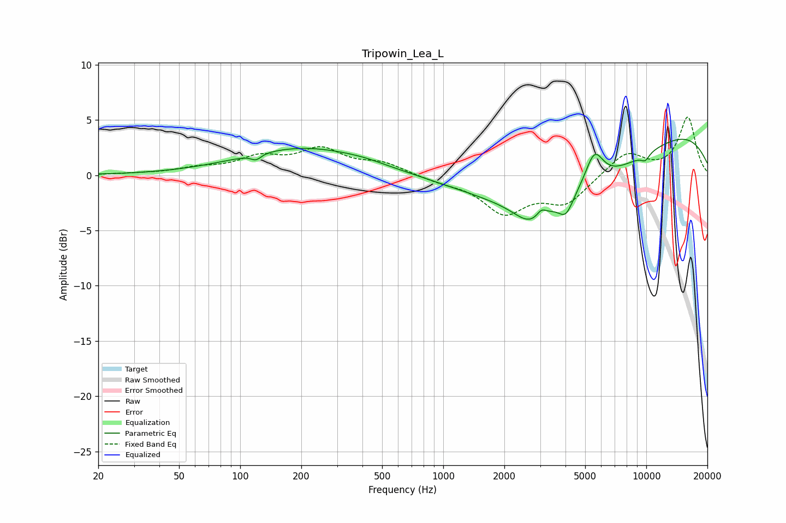

# Tripowin_Lea_L
See [usage instructions](https://github.com/jaakkopasanen/AutoEq#usage) for more options and info.

### Parametric EQs
Apply preamp of -3.4 dB when using parametric equalizer.

|   # | Type    |   Fc (Hz) |    Q |   Gain (dB) |
|-----|---------|-----------|------|-------------|
|   1 | Peaking |       120 | 5.88 |        -0.5 |
|   2 | Peaking |       208 | 0.45 |         2.5 |
|   3 | Peaking |       409 | 1.46 |         0.2 |
|   4 | Peaking |      2704 | 1.69 |        -2   |
|   5 | Peaking |      3044 | 5.95 |         0.7 |
|   6 | Peaking |      4018 | 3.84 |        -1.7 |
|   7 | Peaking |      4333 | 0.34 |        -5.5 |
|   8 | Peaking |      5549 | 3.08 |         3   |
|   9 | Peaking |      9857 | 0.24 |         5.3 |
|  10 | Peaking |      9882 | 5.91 |        -0.6 |

### Fixed Band EQs
When using fixed band (also called graphic) equalizer, apply preamp of **-5.4 dB** (if available) and set gains manually with these parameters.

|   # | Type    |   Fc (Hz) |    Q |   Gain (dB) |
|-----|---------|-----------|------|-------------|
|   1 | Peaking |        31 | 1.41 |         0.1 |
|   2 | Peaking |        62 | 1.41 |         0.5 |
|   3 | Peaking |       125 | 1.41 |         1.4 |
|   4 | Peaking |       250 | 1.41 |         2.2 |
|   5 | Peaking |       500 | 1.41 |         1   |
|   6 | Peaking |      1000 | 1.41 |        -0.5 |
|   7 | Peaking |      2000 | 1.41 |        -3.2 |
|   8 | Peaking |      4000 | 1.41 |        -2.4 |
|   9 | Peaking |      8000 | 1.41 |         2.1 |
|  10 | Peaking |     16000 | 1.41 |         5.2 |

### Graphs

