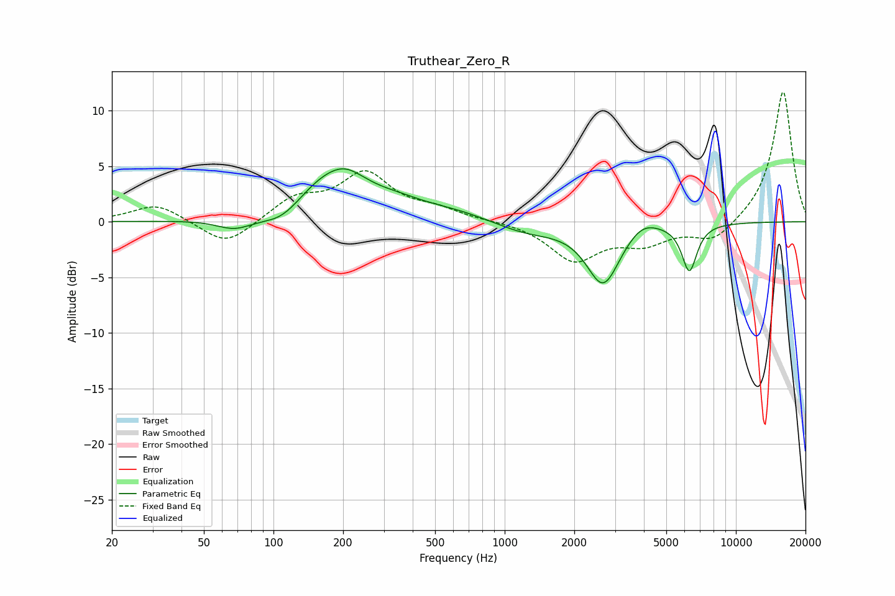

# Truthear_Zero_R
See [usage instructions](https://github.com/jaakkopasanen/AutoEq#usage) for more options and info.

### Parametric EQs
Apply preamp of -4.9 dB when using parametric equalizer.

|   # | Type    |   Fc (Hz) |    Q |   Gain (dB) |
|-----|---------|-----------|------|-------------|
|   1 | Peaking |        68 | 1.78 |        -1.1 |
|   2 | Peaking |       110 | 1.5  |        -1.7 |
|   3 | Peaking |       180 | 0.85 |         4.5 |
|   4 | Peaking |       207 | 2.21 |         0.6 |
|   5 | Peaking |       351 | 1.57 |         0.4 |
|   6 | Peaking |       581 | 0.75 |         0.9 |
|   7 | Peaking |      1228 | 0.96 |        -1.1 |
|   8 | Peaking |      2668 | 1.96 |        -5.5 |
|   9 | Peaking |      3928 | 2.08 |         1.1 |
|  10 | Peaking |      6291 | 4.22 |        -4.2 |

### Fixed Band EQs
When using fixed band (also called graphic) equalizer, apply preamp of **-11.8 dB** (if available) and set gains manually with these parameters.

|   # | Type    |   Fc (Hz) |    Q |   Gain (dB) |
|-----|---------|-----------|------|-------------|
|   1 | Peaking |        31 | 1.41 |         1.6 |
|   2 | Peaking |        62 | 1.41 |        -2.3 |
|   3 | Peaking |       125 | 1.41 |         2   |
|   4 | Peaking |       250 | 1.41 |         4.1 |
|   5 | Peaking |       500 | 1.41 |         0.9 |
|   6 | Peaking |      1000 | 1.41 |         0.1 |
|   7 | Peaking |      2000 | 1.41 |        -3.4 |
|   8 | Peaking |      4000 | 1.41 |        -1.7 |
|   9 | Peaking |      8000 | 1.41 |        -1.8 |
|  10 | Peaking |     16000 | 1.41 |        11.9 |

### Graphs

