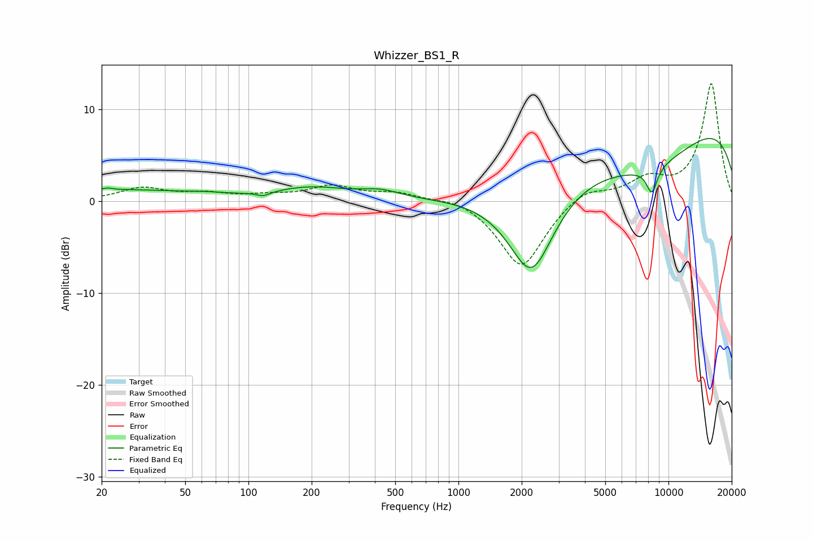

# Whizzer_BS1_R
See [usage instructions](https://github.com/jaakkopasanen/AutoEq#usage) for more options and info.

### Parametric EQs
Apply preamp of -6.9 dB when using parametric equalizer.

|   # | Type    |   Fc (Hz) |    Q |   Gain (dB) |
|-----|---------|-----------|------|-------------|
|   1 | Peaking |        21 | 5.96 |         0.2 |
|   2 | Peaking |        24 | 0.4  |         1.2 |
|   3 | Peaking |        61 | 1.53 |         0.2 |
|   4 | Peaking |       118 | 4.31 |        -0.5 |
|   5 | Peaking |       201 | 0.8  |         1.4 |
|   6 | Peaking |       427 | 1.52 |         0.8 |
|   7 | Peaking |      2229 | 1.18 |       -10.9 |
|   8 | Peaking |      8164 | 0.44 |        -7.1 |
|   9 | Peaking |      8338 | 4.99 |        -2.8 |
|  10 | Peaking |     10000 | 0.2  |        11.6 |

### Fixed Band EQs
When using fixed band (also called graphic) equalizer, apply preamp of **-12.9 dB** (if available) and set gains manually with these parameters.

|   # | Type    |   Fc (Hz) |    Q |   Gain (dB) |
|-----|---------|-----------|------|-------------|
|   1 | Peaking |        31 | 1.41 |         1.4 |
|   2 | Peaking |        62 | 1.41 |         0.7 |
|   3 | Peaking |       125 | 1.41 |         0.5 |
|   4 | Peaking |       250 | 1.41 |         1.5 |
|   5 | Peaking |       500 | 1.41 |         0.9 |
|   6 | Peaking |      1000 | 1.41 |         0.6 |
|   7 | Peaking |      2000 | 1.41 |        -7.4 |
|   8 | Peaking |      4000 | 1.41 |         1.5 |
|   9 | Peaking |      8000 | 1.41 |         2.1 |
|  10 | Peaking |     16000 | 1.41 |        12.8 |

### Graphs

