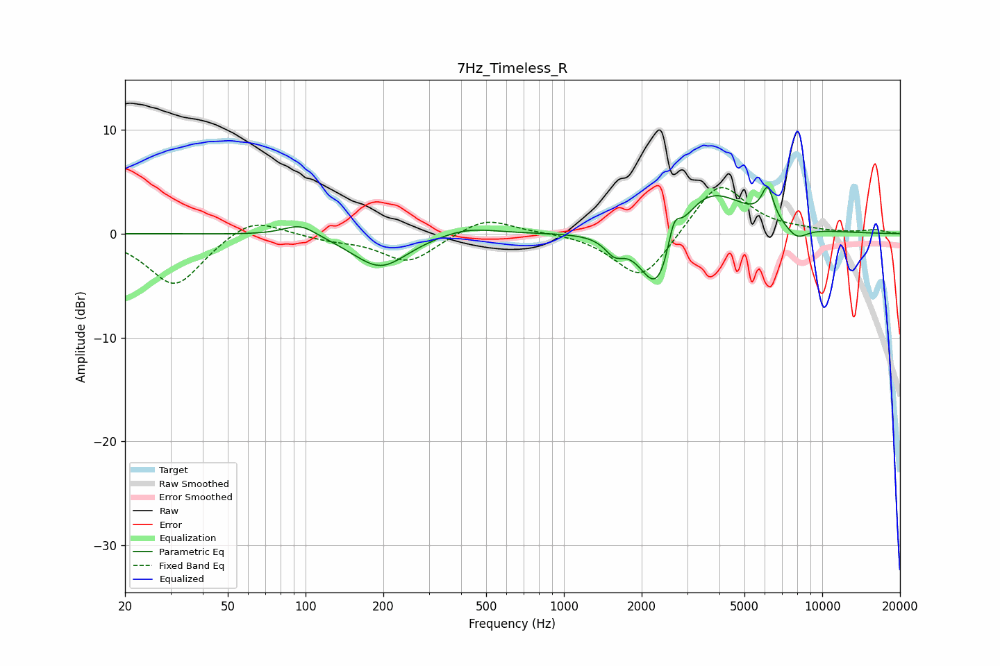

# 7Hz_Timeless_R
See [usage instructions](https://github.com/jaakkopasanen/AutoEq#usage) for more options and info.

### Parametric EQs
Apply preamp of -4.6 dB when using parametric equalizer.

|   # | Type    |   Fc (Hz) |    Q |   Gain (dB) |
|-----|---------|-----------|------|-------------|
|   1 | Peaking |        96 | 2.17 |         1.2 |
|   2 | Peaking |       195 | 1.34 |        -3.3 |
|   3 | Peaking |       420 | 1.28 |         0.8 |
|   4 | Peaking |      1567 | 3.89 |        -1.5 |
|   5 | Peaking |      2302 | 2.21 |        -4.7 |
|   6 | Peaking |      2339 | 1.72 |        -2.7 |
|   7 | Peaking |      2665 | 6    |         2.9 |
|   8 | Peaking |      3552 | 0.99 |         4.9 |
|   9 | Peaking |      6147 | 5.96 |         3.1 |
|  10 | Peaking |      7973 | 3.1  |        -1.3 |

### Fixed Band EQs
When using fixed band (also called graphic) equalizer, apply preamp of **-4.5 dB** (if available) and set gains manually with these parameters.

|   # | Type    |   Fc (Hz) |    Q |   Gain (dB) |
|-----|---------|-----------|------|-------------|
|   1 | Peaking |        31 | 1.41 |        -5.1 |
|   2 | Peaking |        62 | 1.41 |         1.9 |
|   3 | Peaking |       125 | 1.41 |        -0.5 |
|   4 | Peaking |       250 | 1.41 |        -2.8 |
|   5 | Peaking |       500 | 1.41 |         1.7 |
|   6 | Peaking |      1000 | 1.41 |         0.1 |
|   7 | Peaking |      2000 | 1.41 |        -4.7 |
|   8 | Peaking |      4000 | 1.41 |         5.2 |
|   9 | Peaking |      8000 | 1.41 |         0.2 |
|  10 | Peaking |     16000 | 1.41 |         0.3 |

### Graphs

