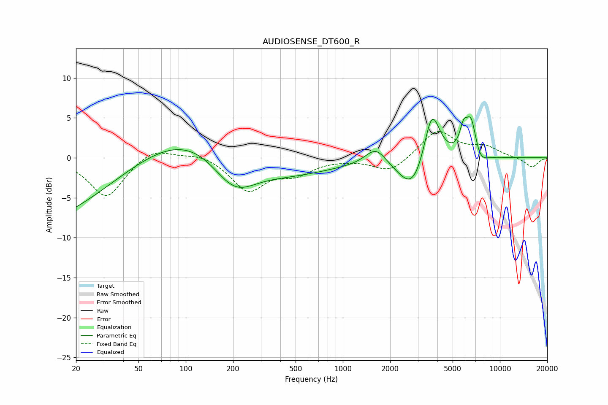

# AUDIOSENSE_DT600_R
See [usage instructions](https://github.com/jaakkopasanen/AutoEq#usage) for more options and info.

### Parametric EQs
Apply preamp of -5.2 dB when using parametric equalizer.

|   # | Type    |   Fc (Hz) |    Q |   Gain (dB) |
|-----|---------|-----------|------|-------------|
|   1 | Peaking |        20 | 0.19 |       -11.2 |
|   2 | Peaking |       109 | 0.21 |        11.3 |
|   3 | Peaking |       203 | 0.9  |        -6.2 |
|   4 | Peaking |       391 | 0.44 |        -6.7 |
|   5 | Peaking |      1622 | 2.11 |         2.2 |
|   6 | Peaking |      2813 | 1.54 |        -4.7 |
|   7 | Peaking |      3682 | 2.63 |         7.3 |
|   8 | Peaking |      5868 | 5.64 |         2.6 |
|   9 | Peaking |      6561 | 4.04 |         4.8 |
|  10 | Peaking |      7442 | 3.04 |        -1.5 |

### Fixed Band EQs
When using fixed band (also called graphic) equalizer, apply preamp of **-3.4 dB** (if available) and set gains manually with these parameters.

|   # | Type    |   Fc (Hz) |    Q |   Gain (dB) |
|-----|---------|-----------|------|-------------|
|   1 | Peaking |        31 | 1.41 |        -5   |
|   2 | Peaking |        62 | 1.41 |         1.5 |
|   3 | Peaking |       125 | 1.41 |         0.7 |
|   4 | Peaking |       250 | 1.41 |        -4   |
|   5 | Peaking |       500 | 1.41 |        -1.7 |
|   6 | Peaking |      1000 | 1.41 |        -0.1 |
|   7 | Peaking |      2000 | 1.41 |        -1.9 |
|   8 | Peaking |      4000 | 1.41 |         3.5 |
|   9 | Peaking |      8000 | 1.41 |         1.2 |
|  10 | Peaking |     16000 | 1.41 |        -1.2 |

### Graphs

